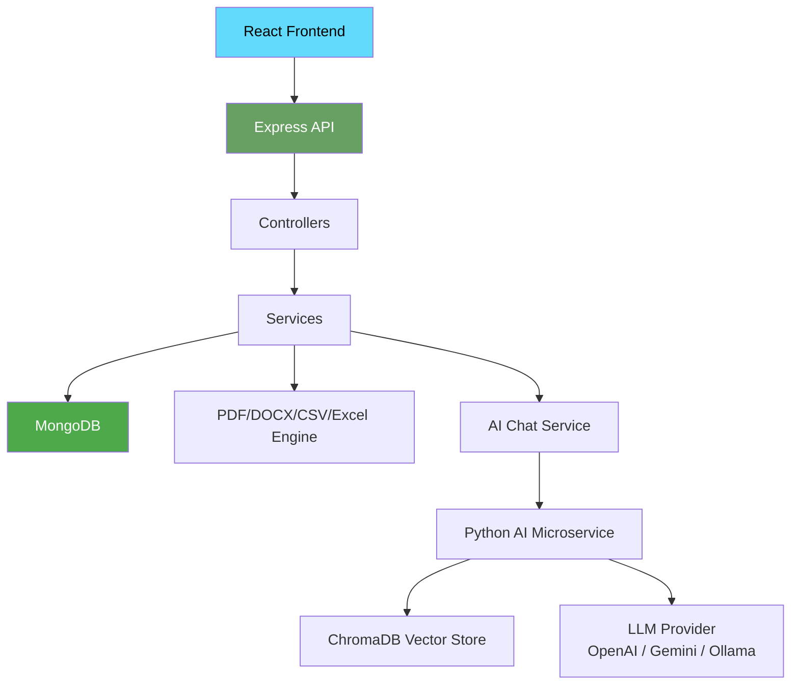
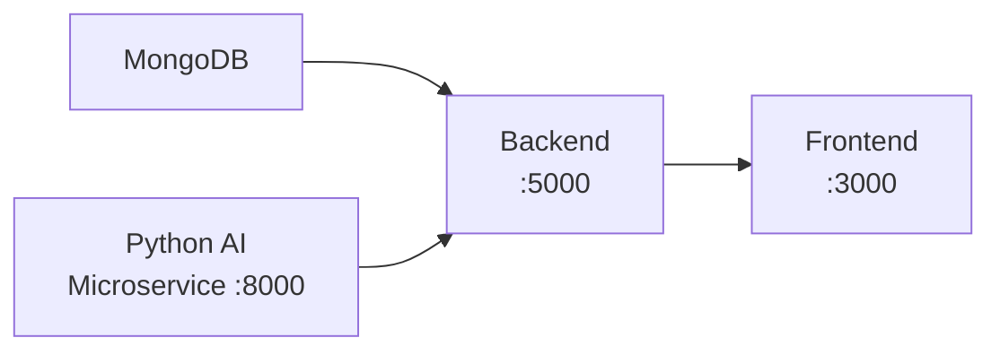
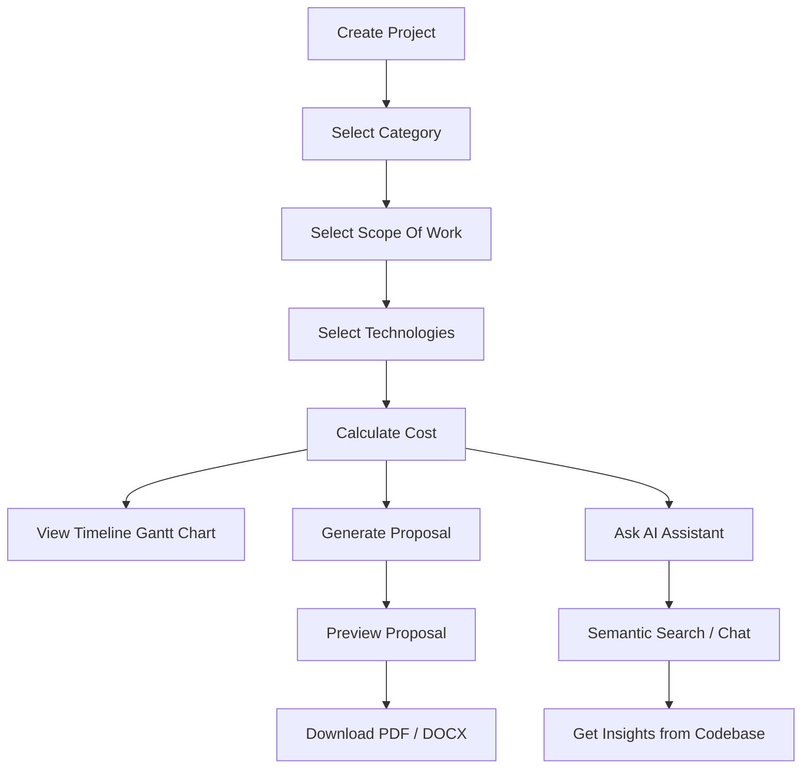

<div align="center">

# 🚀 ProposalForge AI

**Enterprise-Grade Project Management & Proposal Automation Platform**

[]()
[]()
[](https://opensource.org/licenses/MIT)
[](https://nodejs.org/)
[](https://reactjs.org/)
[](https://www.mongodb.com/)
[](https://expressjs.com/)
[](https://tailwindcss.com/)
[](https://python.org/)
[]()
[]()
[]()

</div>

---

## 📋 Table of Contents

- [Overview](#-overview)
- [Features](#-features)
- [System Architecture](#-system-architecture)
- [Tech Stack](#-tech-stack)
- [Folder Structure](#-folder-structure)
- [Installation](#-installation)
- [Environment Variables](#-environment-variables)
- [Running the Project](#-running-the-project)
- [API Documentation](#-api-documentation)
- [Workflow](#-workflow)
- [Screenshots](#-screenshots)
- [Deployment](#-deployment)
- [Troubleshooting](#-troubleshooting)
- [Future Improvements](#-future-improvements)
- [Contributing](#-contributing)
- [Author](#-author)
- [License](#-license)

---

## 📖 Overview

**ProposalForge AI** is a full-stack MERN application that streamlines the sales and project planning lifecycle for agencies, freelancers, and consulting firms. It enables users to create and manage projects, dynamically select scope of work and technologies, perform automated cost calculations, and generate professional proposals in PDF or DOCX format — all with a single click.

An integrated **AI Knowledge System** (Node.js + Python microservice) provides semantic search, intelligent Q&A over project code, and a ChatGPT-style chat interface, powered by LLMs (OpenAI / Gemini / Ollama) and vector embeddings.

| Aspect | Details |
| :--- | :--- |
| **Problem Solved** | Manual proposal creation is slow, inconsistent, and error-prone |
| **Target Users** | Agencies, freelancers, consulting firms, project managers |
| **Business Purpose** | Accelerate sales cycle with automated, professional client proposals |
| **Main Capabilities** | Project CRUD, cost calculation, proposal generation (PDF/DOCX), analytics dashboard, bulk export, AI-powered code Q&A |

---

## ✨ Features

### 📋 Project Management
- Create, edit, and delete projects with comprehensive client details and timelines
- Search, filter by category/status, and paginate through large project lists
- Multi-select dropdown for scope of work with category-based preloading

### 🚀 Proposal Automation
- One-click professional proposal generation with fixed, beautifully formatted templates
- Dynamic content injection — client details, scope, tech stack, and cost summaries
- Real-time HTML preview before generation

### 📊 Analytics Dashboard
- 12 interactive chart types: Bar, Line, Area, Pie, Doughnut, Radar, Composed, and Radial bar
- Revenue tracking calculated only from completed projects
- Section tabs to filter charts: Overview, Distribution, Trends, and Insights
- Gantt chart timeline per project showing scope-of-work milestones

### 📤 Export System
- **PDF export** via Puppeteer (print-ready, pixel-perfect)
- **DOCX export** via docx library (editable Word documents)
- **CSV & Excel bulk export** for external analysis of project database

### 🔧 Dynamic Scope Management
- Category-based scope items load instantly based on project type
- Searchable multi-select dropdown with checkbox precision
- Fully customizable deliverable selection

### 💰 Cost Management
- Dynamic cost calculator that auto-sums project modules
- Custom ad-hoc line items with specific pricing

### 🤖 AI Knowledge System
- Semantic search over project codebase using vector embeddings (384-dim)
- ChatGPT-style conversational chat interface
- Supports OpenAI, Gemini, and local Ollama LLM providers
- Automatic project discovery and file ingestion
- Real-time file watcher for incremental indexing
- Training pipeline with CLI commands (`npm run train-ai`, `npm run retrain-ai`, `npm run ai-status`)
- Python FastAPI microservice for advanced AI operations

---

## 🏗️ System Architecture

```
┌─────────────────────────────────────────────────────┐
│                  React Frontend                      │
│   (ProposalForge UI + AI Chat Interface)            │
└──────────────────────┬──────────────────────────────┘
                       │  REST API (HTTP / JSON)
                       ▼
┌─────────────────────────────────────────────────────┐
│              Express REST API (Node.js)              │
│   ┌───────────┐ ┌──────────┐ ┌──────────────────┐  │
│   │ Projects  │ │ Proposal │ │ Categories       │  │
│   └───────────┘ └──────────┘ └──────────────────┘  │
│   ┌───────────┐ ┌──────────┐ ┌──────────────────┐  │
│   │ Dashboard │ │ Export   │ │ AI (Chat/Train)  │  │
│   └───────────┘ └──────────┘ └──────────────────┘  │
└──────────────────────┬──────────────────────────────┘
                       │
          ┌────────────┼────────────┐
          ▼            ▼            ▼
┌─────────────────┐ ┌──────────┐ ┌──────────────────┐
│  Controllers    │ │ Services │ │ Middleware        │
│  (Request       │ │ (Business│ │ (Error, Auth,    │
│   Handlers)     │ │  Logic)  │ │  Validation)     │
└─────────────────┘ └──────────┘ └──────────────────┘
          │              │
          ▼              ▼
┌─────────────────────────────────────────────────────┐
│                    MongoDB                           │
│              (Mongoose ODM via Mongoose 8)           │
└──────────────────────┬──────────────────────────────┘
                       │
                       ▼
┌─────────────────────────────────────────────────────┐
│          Document Generation Services                │
│  ┌──────────┐ ┌────────┐ ┌───────┐ ┌───────────┐  │
│  │ Puppeteer│ │ docx   │ │json2csv│ │ xlsx      │  │
│  │ (PDF)    │ │ (DOCX) │ │ (CSV)  │ │ (Excel)   │  │
│  └──────────┘ └────────┘ └───────┘ └───────────┘  │
└─────────────────────────────────────────────────────┘

┌─────────────────────────────────────────────────────┐
│              AI Knowledge System                     │
│  ┌─────────────────────┐  ┌──────────────────────┐  │
│  │ Node.js AI Layer    │  │ Python FastAPI       │  │
│  │ (LangChain-style)   │◄─┤ Microservice         │  │
│  │ - Chat Service      │  │ - LangChain          │  │
│  │ - Embedding Service │  │ - ChromaDB (vectors) │  │
│  │ - Training Pipeline │  │ - Sentence           │  │
│  │ - File Watcher      │  │   Transformers       │  │
│  └─────────────────────┘  └──────────────────────┘  │
└─────────────────────────────────────────────────────┘
```

### Data Flow



---

## 💻 Tech Stack

### Frontend

| Technology | Purpose |
| :--- | :--- |
| **React 18** | Component-driven UI |
| **Tailwind CSS 3** | Utility-first styling |
| **React Router 6** | Client-side navigation |
| **Axios** | HTTP client for API interactions |
| **Recharts** | Interactive charts & graphs |
| **Framer Motion** | Page/component animations |
| **React Toastify** | Notification alerts |
| **React Icons** | Icon library |
| **html2canvas / jsPDF** | Client-side document capture |

### Backend

| Technology | Purpose |
| :--- | :--- |
| **Node.js 18+** | JavaScript runtime |
| **Express 4** | Web framework & REST API |
| **Mongoose 8** | MongoDB ODM |
| **express-validator** | Request validation |
| **cors** | Cross-origin resource sharing |
| **dotenv** | Environment variable management |

### Database

| Technology | Purpose |
| :--- | :--- |
| **MongoDB** | NoSQL document database (local, default: `mongodb://localhost:27017/projectmanager`) |

### Document Generation & Export

| Technology | Purpose |
| :--- | :--- |
| **Puppeteer** | Headless Chrome for PDF generation |
| **docx** | Word document (.docx) generation |
| **json2csv** | CSV export |
| **xlsx** | Excel (.xlsx) export |

### AI Knowledge System (Node.js)

| Technology | Purpose |
| :--- | :--- |
| **LangChain-style Services** | AI chat, embedding, ingestion, training pipeline |
| **uuid** | Unique conversation IDs |
| **Axios** | HTTP client to Python microservice |

### AI Knowledge System (Python Microservice)

| Technology | Purpose |
| :--- | :--- |
| **FastAPI** | Python web framework |
| **LangChain + LangChain-Community** | LLM orchestration & RAG pipelines |
| **ChromaDB** | Vector database for semantic search |
| **sentence-transformers** | 384-dim embedding generation |
| **OpenAI / Gemini / Ollama** | LLM provider support |
| **PyMongo / Motor** | MongoDB integration |
| **pypdf / python-docx** | PDF and DOCX text extraction |

---

## 📂 Folder Structure

```text
ProManage-AI/
├── frontend/                          # React Application
│   ├── public/
│   │   └── index.html                 # HTML template
│   ├── build/                         # Production build output
│   ├── package.json                   # Frontend dependencies
│   ├── postcss.config.js              # PostCSS configuration
│   ├── tailwind.config.js             # Tailwind CSS configuration
│   └── src/
│       ├── App.js                     # Main React component
│       ├── index.js                   # React entry point
│       ├── index.css                  # Global styles
│       ├── components/                # Reusable UI components
│       │   ├── AIChatHistory.jsx
│       │   ├── AIChatWindow.jsx
│       │   ├── AIMessage.jsx
│       │   ├── AIProjectSidebar.jsx
│       │   ├── AITyping.jsx
│       │   ├── ConfirmModal.js
│       │   ├── CostCalculator.js
│       │   ├── DashboardCard.js
│       │   ├── Drawer.js
│       │   ├── GanttChart.js
│       │   ├── Loader.js
│       │   ├── MultiSelect.js
│       │   ├── Pagination.js
│       │   ├── ProjectModal.js
│       │   ├── ProjectTable.js
│       │   ├── ProposalPreview.js
│       │   └── Sidebar.js
│       ├── context/                   # Global state management
│       │   └── AppContext.js
│       ├── hooks/                     # Custom React hooks
│       │   ├── useCategories.js
│       │   └── useDashboard.js
│       ├── pages/                     # Main application pages
│       │   ├── AIChat.jsx
│       │   ├── Calculator.js
│       │   ├── ExportData.js
│       │   ├── Home.js
│       │   ├── NotFound.js
│       │   ├── Projects.js
│       │   └── Proposal.js
│       ├── services/                  # API service layer
│       │   └── api.js
│       └── utils/                     # Helper functions
│           ├── debounce.js
│           ├── formatters.js
│           └── technologiesMapping.js
│
├── backend/                           # Node.js/Express API
│   ├── .env                           # Environment variables
│   ├── package.json                   # Backend dependencies
│   ├── server.js                      # Express server entry point
│   ├── ai/                            # AI Knowledge System
│   │   ├── init.js                    # AI system initialization
│   │   ├── config/                    # AI configuration
│   │   ├── controllers/               # AI route handlers
│   │   ├── models/                    # AI data models
│   │   ├── routes/                    # AI API routes
│   │   │   └── aiRoutes.js           # /api/ai/* endpoints
│   │   ├── services/                  # AI business logic
│   │   │   ├── AIChatService.js
│   │   │   ├── AIEmbeddingService.js
│   │   │   ├── AIIngestService.js
│   │   │   ├── AIProjectDiscoveryService.js
│   │   │   ├── AITrainingService.js
│   │   │   ├── AIWatcherService.js
│   │   │   └── PythonAIClient.js
│   │   ├── scripts/                   # CLI scripts
│   │   │   ├── trainAI.js
│   │   │   ├── retrainAI.js
│   │   │   └── aiStatus.js
│   │   └── utils/                     # AI utilities
│   ├── config/
│   │   └── db.js                      # MongoDB connection
│   ├── controllers/                   # Route request handlers
│   │   ├── categoryController.js
│   │   ├── dashboardController.js
│   │   ├── exportController.js
│   │   ├── projectController.js
│   │   └── proposalController.js
│   ├── data/
│   │   └── categories.js              # Project categories & scope items
│   ├── logs/                          # AI log files
│   ├── middleware/
│   │   ├── errorMiddleware.js
│   │   └── notFoundMiddleware.js
│   ├── models/
│   │   └── Project.js                 # Mongoose project model
│   ├── routes/                        # API route definitions
│   │   ├── categoryRoutes.js
│   │   ├── dashboardRoutes.js
│   │   ├── exportRoutes.js
│   │   ├── projectRoutes.js
│   │   └── proposalRoutes.js
│   ├── services/                      # Business logic services
│   │   ├── exportService.js
│   │   ├── pdfService.js
│   │   ├── proposalService.js
│   │   └── wordService.js
│   └── utils/
│       └── apiResponse.js             # API response helper
│
├── python-ai/                         # Python AI Microservice
│   ├── app.py                         # FastAPI entry point
│   ├── requirements.txt               # Python dependencies
│   ├── config/
│   │   ├── settings.py
│   │   └── aiConfig.py
│   ├── services/                      # AI microservices
│   │   ├── AIChatService.py
│   │   ├── AIEmbeddingService.py
│   │   ├── AIHealthService.py
│   │   ├── AIIngestService.py
│   │   ├── AIProjectDiscoveryService.py
│   │   ├── AITrainingService.py
│   │   └── AIWatcherService.py
│   ├── routes/
│   │   ├── healthRoutes.py
│   │   ├── trainRoutes.py
│   │   ├── chatRoutes.py
│   │   └── statusRoutes.py
│   └── utils/
│       ├── logger.py
│       ├── fileUtils.py
│       └── textUtils.py
│
├── Documents/                         # Generated proposal PDFs
├── .gitignore
└── README.md
```

---

## 📸 Screenshots

| Dashboard | Project Management |
| :---: | :---: |
|  |  |

| Generated Proposal (PDF) | AI Chat Interface |
| :---: | :---: |
|  |  |

> **Note:** Replace placeholder images with actual application screenshots.

---

## ⚙️ Installation

### Prerequisites

- Node.js 18+
- MongoDB (local or Docker)
- Python 3.13+ *(optional — for AI microservice)*
- npm or yarn

### 1. Clone the Repository

```bash
git clone https://github.com/Ritesh151/ProManage-AI.git
cd ProManage-AI
```

### 2. Backend Setup

```bash
cd backend
cp .env.example .env   # Configure environment variables
npm install
npm run dev            # Starts on http://localhost:5000
```

### 3. Frontend Setup

```bash
cd frontend
npm install
npm start              # Starts on http://localhost:3000
```

### 4. Python AI Microservice (Optional)

```bash
cd python-ai
python -m venv myenv
source myenv/bin/activate   # On Windows: myenv\Scripts\activate
pip install -r requirements.txt
uvicorn app:app --reload     # Starts on http://localhost:8000
```

### 5. Train AI Knowledge Base

```bash
cd backend
npm run train-ai       # Index project files into vector store
```

---

## 🔑 Environment Variables

Create a `.env` file in the `backend` directory:

```env
# Database
MONGODB_URI=mongodb://localhost:27017/ai-knowledge

# Server
PORT=5000
NODE_ENV=development

# AI System Configuration
AI_LLM_PROVIDER=openai           # openai | gemini | ollama
AI_EMBEDDING_PROVIDER=huggingface
AI_VECTOR_DB_TYPE=chroma

# OpenAI Configuration (required if AI_LLM_PROVIDER=openai)
OPENAI_API_KEY=sk-your-key-here
OPENAI_MODEL=gpt-3.5-turbo
OPENAI_TEMPERATURE=0.7
OPENAI_MAX_TOKENS=2000

# Gemini Configuration (optional)
GEMINI_API_KEY=your-key-here
GEMINI_MODEL=gemini-pro
GEMINI_TEMPERATURE=0.7

# Ollama Configuration (optional, for local LLM)
OLLAMA_BASE_URL=http://localhost:11434
OLLAMA_MODEL=mistral

# Chroma Vector Database
CHROMA_HOST=localhost
CHROMA_PORT=8000
CHROMA_PERSIST_DIR=./data/chroma

# AI Retrieval
AI_TOP_K=5
AI_SIMILARITY_THRESHOLD=0.5

# AI Training
AI_BATCH_SIZE=10
AI_MAX_CONCURRENT_FILES=5

# AI Watcher
AI_WATCHER_ENABLED=true
AI_WATCHER_DEBOUNCE=2000
```

---

## 🚀 Running the Project



| Service | Command | Directory | URL |
| :--- | :--- | :--- | :--- |
| MongoDB | `docker run -d -p 27017:27017 mongo:latest` | — | `mongodb://localhost:27017` |
| Backend | `npm run dev` | `./backend` | `http://localhost:5000` |
| Frontend | `npm start` | `./frontend` | `http://localhost:3000` |
| Python AI | `uvicorn app:app --reload` | `./python-ai` | `http://localhost:8000` |

---

## 📡 API Documentation

### Projects

| Method | Endpoint | Description |
| :--- | :--- | :--- |
| `POST` | `/api/projects/create` | Create a new project |
| `GET` | `/api/projects` | Fetch all projects (search, filter, pagination, sort) |
| `GET` | `/api/projects/:id` | Fetch a single project by ID |
| `PUT` | `/api/projects/:id` | Update project details |
| `DELETE` | `/api/projects/:id` | Delete a project |

### Proposal Automation

| Method | Endpoint | Description |
| :--- | :--- | :--- |
| `GET` | `/api/proposal/generate/:id` | Preview proposal as HTML |
| `GET` | `/api/proposal/pdf/:id` | Download proposal as PDF |
| `GET` | `/api/proposal/word/:id` | Download proposal as DOCX |

### Bulk Export

| Method | Endpoint | Description |
| :--- | :--- | :--- |
| `GET` | `/api/export/csv` | Export all projects as CSV |
| `GET` | `/api/export/excel` | Export all projects as Excel (.xlsx) |
| `GET` | `/api/export/pdf` | Export all projects as PDF |

### Dashboard & Categories

| Method | Endpoint | Description |
| :--- | :--- | :--- |
| `GET` | `/api/dashboard` | Dashboard overview + 12 chart datasets |
| `GET` | `/api/categories` | Get all project categories with scope items |
| `GET` | `/api/health` | Health check |

### AI Knowledge System

| Method | Endpoint | Description |
| :--- | :--- | :--- |
| `POST` | `/api/ai/train` | Start full training |
| `POST` | `/api/ai/retrain` | Start incremental training |
| `GET` | `/api/ai/status` | Get AI system status |
| `GET` | `/api/ai/training-history` | Get training sessions |
| `GET` | `/api/ai/training-stats` | Get training statistics |
| `POST` | `/api/ai/chat` | Send a chat message |
| `GET` | `/api/ai/conversation/:id` | Get conversation by ID |
| `GET` | `/api/ai/conversations` | Get all user conversations |
| `DELETE` | `/api/ai/conversation/:id` | Clear a conversation |
| `GET` | `/api/ai/projects` | Get discovered project paths |
| `POST` | `/api/ai/feedback` | Submit chat feedback |

---

## 🔄 Workflow



---

## 🌐 Deployment

### Prerequisites for Production

- [ ] Set `NODE_ENV=production`
- [ ] Configure production MongoDB (Atlas or self-hosted)
- [ ] Set up reverse proxy (Nginx / Caddy)
- [ ] Build frontend: `cd frontend && npm run build`
- [ ] Serve frontend build via Express or CDN
- [ ] (Optional) Containerize with Docker
- [ ] (Optional) Deploy Python AI microservice on separate instance
- [ ] Configure SSL / HTTPS

### Build Commands

```bash
# Frontend production build
cd frontend && npm run build

# Backend production start
cd backend && NODE_ENV=production npm start

# Python AI microservice production
cd python-ai && uvicorn app:app --host 0.0.0.0 --port 8000
```

---

## 🔧 Troubleshooting

| Problem | Solution |
| :--- | :--- |
| MongoDB connection refused | Ensure MongoDB is running (`docker ps` or `mongod`) |
| Backend won't start | Verify `MONGODB_URI` in `.env` and run `npm install` |
| PDF generation fails | Ensure Chrome/Chromium is available (Puppeteer requirement) |
| AI chat returns empty | Run `npm run train-ai` first to index project files |
| Python microservice errors | Activate the virtual environment and verify dependencies |
| CORS errors | Check that frontend proxy is set to `http://localhost:5000` |
| Slow AI responses | First response is slower (embedding generation); subsequent responses use cache |

---

## 🔮 Future Improvements

- [ ] **Email Integration**: Send proposals directly to clients via email
- [ ] **AI Proposal Suggestions**: OpenAI integration for dynamically writing project summaries
- [ ] **Multi-User Roles**: Admin, Manager, and Sales representative roles
- [ ] **Authentication**: Secure JWT login system
- [ ] **Cloud Deployment**: One-click deploy configurations (Docker, AWS, Vercel)

---

## 🤝 Contributing

Contributions are welcome! Please open an issue or submit a pull request.

1. Fork the repository
2. Create a feature branch (`git checkout -b feature/amazing-feature`)
3. Commit your changes (`git commit -m 'Add amazing feature'`)
4. Push to the branch (`git push origin feature/amazing-feature`)
5. Open a Pull Request

---

## 👨‍💻 Author

Project developed by:  
**Ritesh Gajjar**

- GitHub: [@Ritesh151](https://github.com/Ritesh151)

---

## 📜 License

This project is licensed under the **MIT License**. See the [LICENSE](LICENSE) file for details.

---

<div align="center">

**ProposalForge AI** — *From Project to Proposal in One Click*

</div>
