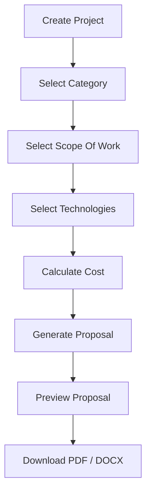

<div align="center">

# 🚀 ProposalForge AI

**MERN Stack Project Management + Proposal Automation System**

[](https://reactjs.org/)
[](https://nodejs.org/)
[](https://expressjs.com/)
[](https://www.mongodb.com/)
[](https://opensource.org/licenses/MIT)
[]()

</div>

---

## 📖 Overview

**ProposalForge AI** is a comprehensive, MERN-based project proposal automation platform designed to streamline the sales and planning lifecycle for agencies and freelancers. It empowers users to efficiently create projects, manage client data, dynamically select the scope of work and relevant technologies, and perform automated cost calculations.

With a single click, users can generate highly professional, production-ready proposals and seamlessly export them to PDF or DOCX formats for immediate client delivery.

---

## ✨ Features

### ✅ Project Management
- **Create Project**: Add comprehensive details including client info and timelines.
- **Edit & Delete**: Seamlessly modify or remove existing projects.
- **Search & Filter**: Powerful search capabilities with dynamic category and status filtering.
- **Pagination**: Optimized data loading for large project lists.

### ✅ Dynamic Scope Of Work
- **Category-Based**: Instantly loads predefined scope items based on project type.
- **Multi-Select Dropdown**: Smooth, searchable selection interface.
- **Customization**: Checkbox selection for precise deliverables.

### ✅ Dynamic Technologies
- **Frontend Technologies**: React JS, Next JS, Vue JS, Tailwind CSS, etc.
- **Backend Technologies**: Node.js, Express, Laravel, Django, etc.
- **Database Technologies**: MongoDB, MySQL, PostgreSQL, etc.
- **Tools**: UI/UX design tools, SEO, Digital Marketing platforms.

### ✅ Cost Calculator
- **Dynamic Cost Calculation**: Automatically sums up project modules.
- **Custom Modules**: Add ad-hoc line items with specific pricing.

### ✅ Proposal Automation
- **Auto Generation**: One-click professional proposal creation.
- **Fixed Templates**: Beautifully formatted, industry-standard layouts.
- **Dynamic Content**: Auto-injects client details, scope, tech stack, and costs.

### ✅ Export Features
- **PDF Export**: Generate flawless, print-ready PDF files.
- **DOCX Export**: Generate editable Word documents.
- **CSV & Excel Export**: Bulk export your project database for external analysis.

### ✅ Dashboard
- **Analytics Cards**: High-level system statistics.
- **Revenue Tracking**: Live visualization of total potential and active revenue.
- **Recent Projects**: Quick access to the most recent proposals.

---

## 💻 Tech Stack

### Frontend
- **React JS**: Component-driven UI.
- **Tailwind CSS**: Rapid, responsive, utility-first styling.
- **Axios**: HTTP client for seamless API interactions.
- **React Router**: Client-side navigation.
- **React Toastify**: Elegant notification alerts.

### Backend
- **Node JS**: Event-driven runtime.
- **Express JS**: Minimalist web framework.

### Database
- **MongoDB**: NoSQL document database for scalable storage.

### Document Generation
- **Puppeteer**: Headless Chrome node API for precise PDF generation.
- **docx**: Pure JavaScript library for generating Word documents.

---

## 📂 Folder Structure

```text
ProposalForge-AI/
├── frontend/             # React JS Application
│   ├── public/
│   └── src/
│       ├── components/   # Reusable UI components
│       ├── context/      # Global state management
│       ├── hooks/        # Custom React hooks
│       ├── pages/        # Main application routes
│       ├── services/     # Axios API handlers
│       └── utils/        # Helper functions & formatters
│
└── backend/              # Node.js/Express API
    ├── config/           # Database & environment configs
    ├── controllers/      # Route request handlers
    ├── middleware/       # Custom middleware (Error handling, etc.)
    ├── models/           # Mongoose schemas (Project, etc.)
    ├── routes/           # API route definitions
    └── services/         # Business logic (PDF/Word generation)
```

---

## 📸 Screenshots

| Dashboard | Project Management |
| :---: | :---: |
|  |  |

| Generated Proposal (PDF) |
| :---: |
|  |

*(Note: Replace placeholders with actual application screenshots)*

---

## ⚙️ Installation

To run this project locally, execute the following commands:

**1. Clone the repository**
```bash
git clone https://github.com/Ritesh151/ProManage-AI.git
cd ProManage-AI
```

**2. Setup the Backend**
```bash
cd backend
npm install
npm run dev
```

**3. Setup the Frontend**
```bash
# Open a new terminal window/tab
cd frontend
npm install
npm start
```

---

## 🔑 Environment Variables

Create a `.env` file in the `backend` directory and add the following:

```env
PORT=5000
MONGO_URI=your_mongodb_connection_string_here
```

---

## 📡 API Endpoints

### Projects
| Method | Endpoint | Description |
| :--- | :--- | :--- |
| `POST` | `/api/projects/create` | Create a new project |
| `GET` | `/api/projects` | Fetch all projects (with pagination/filters) |
| `PUT` | `/api/projects/:id` | Update project details |
| `DELETE` | `/api/projects/:id` | Delete a project |

### Proposal Automation
| Method | Endpoint | Description |
| :--- | :--- | :--- |
| `GET` | `/api/proposal/generate/:id` | Get raw HTML/data for preview |
| `GET` | `/api/proposal/pdf/:id` | Download Proposal as PDF |
| `GET` | `/api/proposal/word/:id` | Download Proposal as DOCX |

---

## 🔄 Workflow



---

## 🔮 Future Improvements

- [ ] **Email Integration**: Send proposals directly to clients via email.
- [ ] **AI Proposal Suggestions**: OpenAI integration for dynamically writing project summaries.
- [ ] **Multi-User Roles**: Admin, Manager, and Sales representative roles.
- [ ] **Authentication**: Secure JWT login system.
- [ ] **Cloud Deployment**: One-click deploy configurations (Docker, AWS, Vercel).

---

## 👨‍💻 Author

Project developed by:  
**Ritesh Gajjar**

---

## 📜 License

This project is licensed under the **MIT License**.
