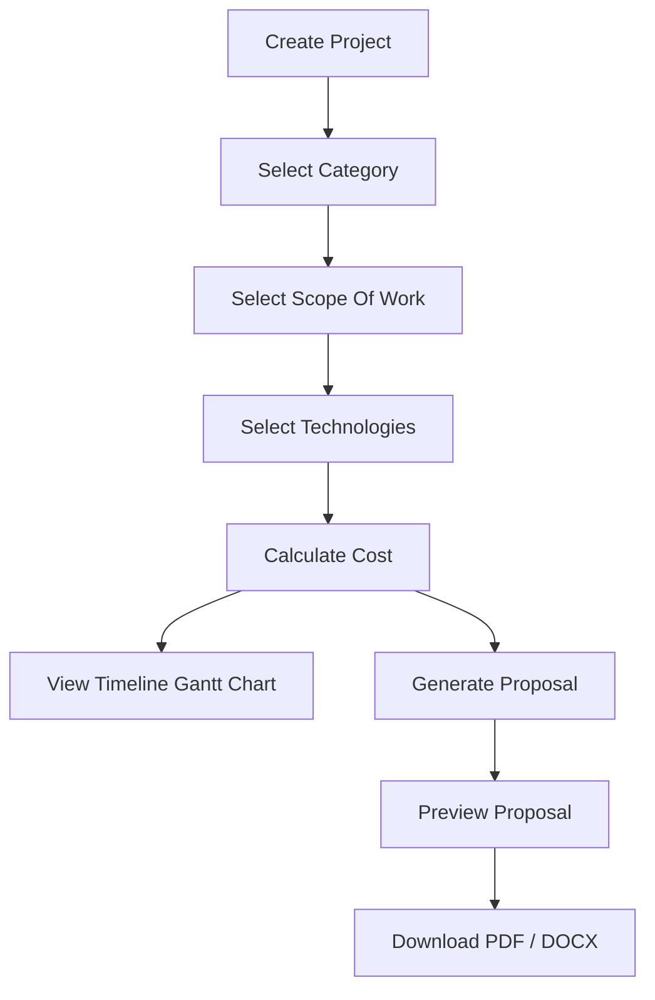

<div align="center">

# 🚀 ProposalForge AI

**MERN Stack Project Management + Proposal Automation System**

[](https://reactjs.org/)
[](https://nodejs.org/)
[](https://expressjs.com/)
[](https://www.mongodb.com/)
[](https://tailwindcss.com/)
[](https://opensource.org/licenses/MIT)
[]()

</div>

---

## 📖 Overview

**ProposalForge AI** is a comprehensive, MERN-based project proposal automation platform designed to streamline the sales and planning lifecycle for agencies and freelancers. It empowers users to efficiently create projects, manage client data, dynamically select the scope of work and relevant technologies, and perform automated cost calculations.

With a single click, users can generate highly professional, production-ready proposals and seamlessly export them to PDF or DOCX formats for immediate client delivery.

---

## ✨ Features

### ✅ Project Management
- **Create Project**: Add comprehensive details including client info and timelines.
- **Edit & Delete**: Seamlessly modify or remove existing projects.
- **Search & Filter**: Powerful search capabilities with dynamic category and status filtering.
- **Pagination**: Optimized data loading for large project lists.

### ✅ Dynamic Scope Of Work
- **Category-Based**: Instantly loads predefined scope items based on project type.
- **Multi-Select Dropdown**: Smooth, searchable selection interface.
- **Customization**: Checkbox selection for precise deliverables.

### ✅ Dynamic Technologies
- **Frontend Technologies**: React JS, Next JS, Vue JS, Tailwind CSS, etc.
- **Backend Technologies**: Node.js, Express, Laravel, Django, etc.
- **Database Technologies**: MongoDB, MySQL, PostgreSQL, etc.
- **Tools**: UI/UX design tools, SEO, Digital Marketing platforms.

### ✅ Cost Calculator
- **Dynamic Cost Calculation**: Automatically sums up project modules.
- **Custom Modules**: Add ad-hoc line items with specific pricing.

### ✅ Proposal Automation
- **Auto Generation**: One-click professional proposal creation.
- **Fixed Templates**: Beautifully formatted, industry-standard layouts.
- **Dynamic Content**: Auto-injects client details, scope, tech stack, and costs.

### ✅ Export Features
- **PDF Export**: Generate flawless, print-ready PDF files.
- **DOCX Export**: Generate editable Word documents.
- **CSV & Excel Export**: Bulk export your project database for external analysis.

### ✅ Analytics Dashboard
- **12 Interactive Charts**: Bar, Line, Area, Pie, Doughnut, Radar, Composed, and Radial bar charts.
- **Revenue Tracking**: Revenue calculated only from completed projects.
- **Section Tabs**: Filter charts by Overview, Distribution, Trends, and Insights.
- **Project Timeline**: Gantt chart visualization per project showing scope of work milestones.

---

## 💻 Tech Stack

### Frontend
| Technology | Purpose |
| :--- | :--- |
| **React 18** | Component-driven UI |
| **Tailwind CSS 3** | Utility-first styling |
| **Axios** | HTTP client for API interactions |
| **React Router 6** | Client-side navigation |
| **React Toastify** | Notification alerts |
| **Framer Motion** | Page/component animations |
| **React Icons** | Icon library |
| **Recharts** | Interactive charts & graphs |

### Backend
| Technology | Purpose |
| :--- | :--- |
| **Node.js** | JavaScript runtime |
| **Express 4** | Web framework & REST API |
| **Mongoose 8** | MongoDB ODM |
| **express-validator** | Request validation |
| **cors** | Cross-origin resource sharing |
| **dotenv** | Environment variable management |

### Database
| Technology | Purpose |
| :--- | :--- |
| **MongoDB** | NoSQL document database (local, default: `mongodb://localhost:27017/projectmanager`) |

### Document Generation & Export
| Technology | Purpose |
| :--- | :--- |
| **Puppeteer** | Headless Chrome for PDF generation |
| **docx** | Word document generation |
| **json2csv** | CSV export |
| **xlsx** | Excel export |

---

## 📂 Folder Structure

```text
ProposalForge-AI/
├── frontend/                 # React Application
│   ├── public/
│   ├── build/                # Production build output
│   └── src/
│       ├── components/       # Reusable UI components
│       ├── context/          # Global state (useReducer)
│       ├── hooks/            # Custom React hooks
│       ├── pages/            # Main application pages
│       ├── services/         # Axios API handlers
│       └── utils/            # Helpers, formatters, tech mappings
│
├── backend/                  # Node.js/Express API
│   ├── config/               # Database connection config
│   ├── controllers/          # Route request handlers
│   ├── data/                 # Predefined scope items per category
│   ├── middleware/           # Error handling & 404 middleware
│   ├── models/               # Mongoose schemas
│   ├── routes/               # API route definitions
│   ├── services/             # Business logic (PDF/Word/export)
│   └── utils/                # API response helper
│
└── Documents/                # Generated proposal PDFs
```

---

## 📸 Screenshots

| Dashboard | Project Management |
| :---: | :---: |
|  |  |

| Generated Proposal (PDF) |
| :---: |
|  |

*(Note: Replace placeholders with actual application screenshots)*

---

## ⚙️ Installation

To run this project locally, execute the following commands:

**1. Clone the repository**
```bash
git clone https://github.com/Ritesh151/ProManage-AI.git
cd ProManage-AI
```

**2. Setup the Backend**
```bash
cd backend
npm install
npm run dev
```

**3. Setup the Frontend**
```bash
# Open a new terminal window/tab
cd frontend
npm install
npm start
```

---

## 🔑 Environment Variables

Create a `.env` file in the `backend` directory with the following:

```env
PORT=5000
MONGO_URI=mongodb://localhost:27017/projectmanager
```

---

## 📡 API Endpoints

### Projects
| Method | Endpoint | Description |
| :--- | :--- | :--- |
| `POST` | `/api/projects/create` | Create a new project |
| `GET` | `/api/projects` | Fetch all projects (search, filter, pagination, sort) |
| `GET` | `/api/projects/:id` | Fetch a single project by ID |
| `PUT` | `/api/projects/:id` | Update project details |
| `DELETE` | `/api/projects/:id` | Delete a project |

### Proposal Automation
| Method | Endpoint | Description |
| :--- | :--- | :--- |
| `GET` | `/api/proposal/generate/:id` | Preview proposal as HTML |
| `GET` | `/api/proposal/pdf/:id` | Download proposal as PDF |
| `GET` | `/api/proposal/word/:id` | Download proposal as DOCX |

### Bulk Export
| Method | Endpoint | Description |
| :--- | :--- | :--- |
| `GET` | `/api/export/csv` | Export all projects as CSV |
| `GET` | `/api/export/excel` | Export all projects as Excel (.xlsx) |
| `GET` | `/api/export/pdf` | Export all projects as PDF |

### Dashboard & Categories
| Method | Endpoint | Description |
| :--- | :--- | :--- |
| `GET` | `/api/dashboard` | Dashboard overview + 12 chart datasets |
| `GET` | `/api/categories` | Get all project categories with scope items |
| `GET` | `/api/health` | Health check |

---

## 🔄 Workflow



---

## 🔮 Future Improvements

- [ ] **Email Integration**: Send proposals directly to clients via email.
- [ ] **AI Proposal Suggestions**: OpenAI integration for dynamically writing project summaries.
- [ ] **Multi-User Roles**: Admin, Manager, and Sales representative roles.
- [ ] **Authentication**: Secure JWT login system.
- [ ] **Cloud Deployment**: One-click deploy configurations (Docker, AWS, Vercel).

---

## 👨‍💻 Author

Project developed by:  
**Ritesh Gajjar**

---

## 📜 License

This project is licensed under the **MIT License**.
