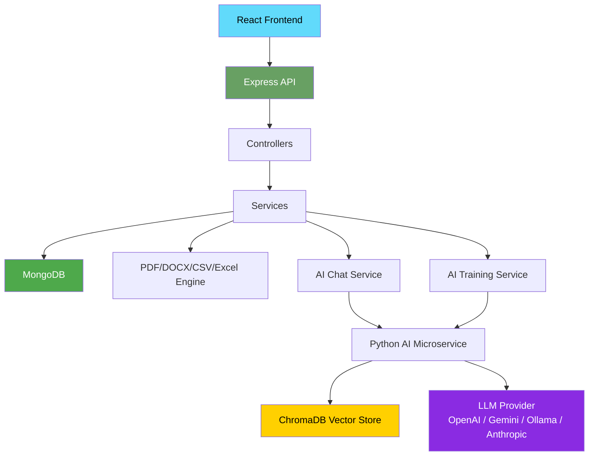
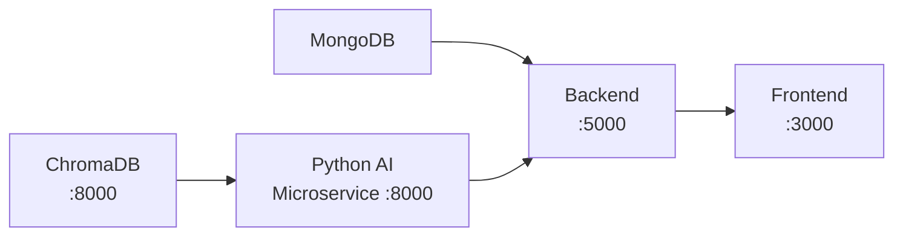
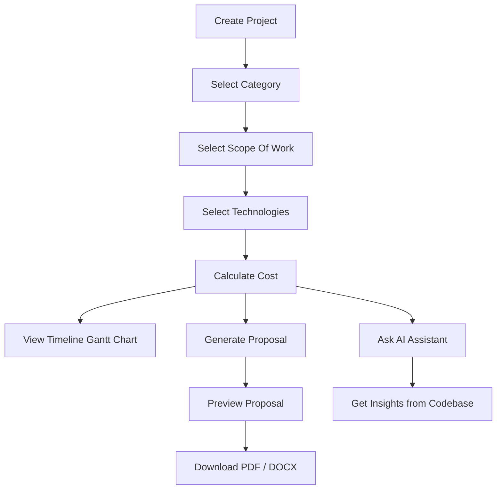

<div align="center">

# 🚀 ProposalForge AI

**Enterprise-Grade Project Management & Proposal Automation Platform**

[]()
[]()
[](https://opensource.org/licenses/MIT)
[](https://nodejs.org/)
[](https://reactjs.org/)
[](https://www.mongodb.com/)
[](https://expressjs.com/)
[](https://tailwindcss.com/)
[](https://python.org/)
[](https://fastapi.tiangolo.com/)
[](https://www.trychroma.com/)
[]()
[]()
[]()
[]()

</div>

---

## 📋 Table of Contents

- [Overview](#-overview)
- [Features](#-features)
- [System Architecture](#-system-architecture)
- [Tech Stack](#-tech-stack)
- [Folder Structure](#-folder-structure)
- [Installation](#-installation)
- [Environment Variables](#-environment-variables)
- [Running the Project](#-running-the-project)
- [API Documentation](#-api-documentation)
- [Workflow](#-workflow)
- [Screenshots](#-screenshots)
- [Deployment](#-deployment)
- [Troubleshooting](#-troubleshooting)
- [Future Improvements](#-future-improvements)
- [Contributing](#-contributing)
- [Author](#-author)
- [License](#-license)

---

## 📖 Overview

**ProposalForge AI** is a full-stack MERN application that streamlines the sales and project planning lifecycle for agencies, freelancers, and consulting firms. It enables users to create and manage projects, dynamically select scope of work and technologies, perform automated cost calculations, and generate professional proposals in PDF or DOCX format — all with a single click.

An integrated **AI Knowledge System** (Node.js + Python microservice) provides intelligent Q&A over project code and a ChatGPT-style chat interface, powered by multiple LLM providers (OpenAI, Gemini, Ollama, Anthropic) and vector embeddings via ChromaDB. The system features a fully functional Training Center with real-time progress tracking, live logs, and training history.

| Aspect | Details |
| :--- | :--- |
| **Problem Solved** | Manual proposal creation is slow, inconsistent, and error-prone |
| **Target Users** | Agencies, freelancers, consulting firms, project managers |
| **Business Purpose** | Accelerate sales cycle with automated, professional client proposals |
| **Main Capabilities** | Project CRUD, cost calculation, proposal generation (PDF/DOCX), analytics dashboard, bulk export, AI-powered code Q&A |

---

## ✨ Features

### 📋 Project Management
- Create, edit, and delete projects with comprehensive client details and timelines
- Search, filter by category/status, and paginate through large project lists
- Multi-select dropdown for scope of work with category-based preloading

### 🚀 Proposal Automation
- One-click professional proposal generation with fixed, beautifully formatted templates
- Dynamic content injection — client details, scope, tech stack, and cost summaries
- Real-time HTML preview before generation

### 📊 Analytics Dashboard
- 12 interactive chart types: Bar, Line, Area, Pie, Doughnut, Radar, Composed, and Radial bar
- Revenue tracking calculated only from completed projects
- Section tabs to filter charts: Overview, Distribution, Trends, and Insights
- Gantt chart timeline per project showing scope-of-work milestones

### 📤 Export System
- **PDF export** via Puppeteer (print-ready, pixel-perfect)
- **DOCX export** via docx library (editable Word documents)
- **CSV & Excel bulk export** for external analysis of project database

### 🔧 Dynamic Scope Management
- Category-based scope items load instantly based on project type
- Searchable multi-select dropdown with checkbox precision
- Fully customizable deliverable selection

### 💰 Cost Management
- Dynamic cost calculator that auto-sums project modules
- Custom ad-hoc line items with specific pricing

### 🤖 AI Knowledge System
- ChatGPT-style conversational chat interface
- Supports OpenAI, Gemini, and local Ollama LLM providers
- **New LLM Integration**: Added support for additional LLM providers with flexible configuration via `AI_LLM_PROVIDER` environment variable
- **Enhanced Training Pipeline**: Full training, incremental retraining, and safe stop controls via Training Center UI
- Automatic project discovery and file ingestion across `frontend/`, `backend/`, `python-ai/`, `docs/`, `templates/`
- Real-time file watcher for incremental indexing
- Training Center page with real-time progress bars, live logs, training history, and knowledge statistics
- Python FastAPI microservice for advanced AI operations with ChromaDB vector storage
- Polling-based real-time status updates (2s interval) during training sessions

---

## 🏗️ System Architecture

```
┌─────────────────────────────────────────────────────┐
│                  React Frontend                      │
│   (ProposalForge UI + AI Chat + Training Center)    │
└──────────────────────┬──────────────────────────────┘
                       │  REST API (HTTP / JSON)
                       ▼
┌─────────────────────────────────────────────────────┐
│              Express REST API (Node.js)              │
│   ┌───────────┐ ┌──────────┐ ┌──────────────────┐  │
│   │ Projects  │ │ Proposal │ │ Categories       │  │
│   └───────────┘ └──────────┘ └──────────────────┘  │
│   ┌───────────┐ ┌──────────┐ ┌──────────────────┐  │
│   │ Dashboard │ │ Export   │ │ AI (Chat/Train)  │  │
│   └───────────┘ └──────────┘ └──────────────────┘  │
└──────────────────────┬──────────────────────────────┘
                       │
          ┌────────────┼────────────┐
          ▼            ▼            ▼
┌─────────────────┐ ┌──────────┐ ┌──────────────────┐
│  Controllers    │ │ Services │ │ Middleware        │
│  (Request       │ │ (Business│ │ (Error, Auth,    │
│   Handlers)     │ │  Logic)  │ │  Validation)     │
└─────────────────┘ └──────────┘ └──────────────────┘
          │              │
          ▼              ▼
┌─────────────────────────────────────────────────────┐
│                    MongoDB                           │
│              (Mongoose ODM via Mongoose 8)           │
│   ┌─────────────┐ ┌──────────────┐ ┌─────────────┐ │
│   │ Projects    │ │ AIDocument   │ │ AITraining  │ │
│   │ Scopes      │ │ AIChatHistory│ │ Sessions    │ │
│   └─────────────┘ └──────────────┘ └─────────────┘ │
└─────────────────────────────────────────────────────┘

┌─────────────────────────────────────────────────────┐
│              AI Knowledge System                     │
│  ┌─────────────────────┐  ┌──────────────────────┐  │
│  │ Node.js AI Layer    │  │ Python FastAPI       │  │
│  │ (Training Pipeline) │◄─┤ Microservice         │  │
│  │ - AITrainingService │  │ - AITrainingService  │  │
│  │ - AIEmbeddingSvc    │  │ - AIEmbeddingService │  │
│  │ - AIIngestService   │  │ - AIIngestService    │  │
│  │ - AIChatService     │  │ - AIChatService      │  │
│  │ - File Watcher      │  │ - File Watcher       │  │
│  │ - PythonAIClient    │  │ - Project Discovery  │  │
│  └─────────────────────┘  └──────────┬───────────┘  │
│                                      │              │
│                                      ▼              │
│                          ┌──────────────────────┐  │
│                          │  ChromaDB            │  │
│                          │  (Vector Database)   │  │
│                          │  - Embeddings        │  │
│                          │  - Vector Search     │  │
│                          └──────────────────────┘  │
│                                      │              │
│                                      ▼              │
│                          ┌──────────────────────┐  │
│                          │  LLM Provider        │  │
│                          │  OpenAI / Gemini /   │  │
│                          │  Ollama / Anthropic  │  │
│                          └──────────────────────┘  │
└─────────────────────────────────────────────────────┘
```

### Data Flow



---

## 💻 Tech Stack

### Frontend

| Technology | Purpose |
| :--- | :--- |
| **React 18** | Component-driven UI |
| **Tailwind CSS 3** | Utility-first styling |
| **React Router 6** | Client-side navigation |
| **Axios** | HTTP client for API interactions |
| **Recharts** | Interactive charts & graphs |
| **Framer Motion** | Page/component animations |
| **React Toastify** | Notification alerts |
| **React Icons** | Icon library |
| **html2canvas / jsPDF** | Client-side document capture |

### Backend

| Technology | Purpose |
| :--- | :--- |
| **Node.js 18+** | JavaScript runtime |
| **Express 4** | Web framework & REST API |
| **Mongoose 8** | MongoDB ODM |
| **express-validator** | Request validation |
| **cors** | Cross-origin resource sharing |
| **dotenv** | Environment variable management |

### Database

| Technology | Purpose |
| :--- | :--- |
| **MongoDB** | NoSQL document database (local, default: `mongodb://localhost:27017/projectmanager`) |

### Document Generation & Export

| Technology | Purpose |
| :--- | :--- |
| **Puppeteer** | Headless Chrome for PDF generation |
| **docx** | Word document (.docx) generation |
| **json2csv** | CSV export |
| **xlsx** | Excel (.xlsx) export |

### AI Knowledge System (Node.js)

| Technology | Purpose |
| :--- | :--- |
| **LangChain-style Services** | AI chat, embedding, ingestion, training pipeline |
| **AITrainingService** | Full training, incremental retraining, stop controls, progress tracking, real-time logs |
| **AIProjectDiscoveryService** | Auto-discovery of projects from configured paths |
| **AIIngestService** | File scanning, chunking (1000/200 overlap), metadata extraction |
| **AIEmbeddingService** | Embedding generation with ChromaDB storage, caching, cosine similarity search |
| **AIWatcherService** | File change detection for incremental retraining |
| **PythonAIClient** | HTTP client with retry logic for Python microservice communication |
| **uuid** | Unique session and conversation IDs |
| **Axios** | HTTP client for Python microservice and external APIs |

### AI Knowledge System (Python Microservice)

| Technology | Purpose |
| :--- | :--- |
| **FastAPI** | Python web framework for AI microservice |
| **LangChain + LangChain-Community** | LLM orchestration & RAG pipelines |
| **ChromaDB** | Vector database for semantic search and embedding storage |
| **sentence-transformers** | 384-dim embedding generation (all-MiniLM-L6-v2) |
| **OpenAI / Gemini / Ollama** | Multi-LLM provider support with configurable selection |
| **New LLM Providers** | Extended support for additional LLM backends via environment configuration |
| **PyMongo / Motor** | MongoDB integration for training session persistence |
| **pypdf / python-docx** | PDF and DOCX text extraction for knowledge ingestion |
| **numpy** | Numerical computing for embedding operations |
| **Threading** | Background training execution with abort controls |

---

## 📂 Folder Structure

```text
Project B/
├── MD Files Documents/                # Documentation files
│   ├── AI_QUICK_START.md
│   ├── AI_SYSTEM_DOCUMENTATION.md
│   ├── CHANGES_SUMMARY.md
│   ├── COMPLETION_REPORT.md
│   ├── DEPLOYMENT_GUIDE.md
│   ├── FRONTEND_EXTENSION_COMPLETE.md
│   ├── FRONTEND_IMPLEMENTATION_SUMMARY.txt
│   ├── FRONTEND_QUICK_REFERENCE.md
│   ├── IMPLEMENTATION_CHECKLIST.md
│   ├── INTEGRATION_GUIDE.md
│   ├── PYTHON_AI_INTEGRATION.md
│   ├── PYTHON_AI_QUICK_START.md
│   ├── PYTHON_AI_SUMMARY.md
│   ├── PYTHON_MICROSERVICE_COMPLETE.md
│   ├── START_HERE.md
│   └── VERIFICATION_CHECKLIST.md
│
├── frontend/                          # React Application
│   ├── public/
│   │   ├── favicon.svg
│   │   └── index.html                 # HTML template
│   ├── build/                         # Production build output
│   ├── package.json                   # Frontend dependencies
│   ├── postcss.config.js              # PostCSS configuration
│   ├── tailwind.config.js             # Tailwind CSS configuration
│   └── src/
│       ├── App.js                     # Main React component
│       ├── index.js                   # React entry point
│       ├── index.css                  # Global styles
│       ├── components/                # Reusable UI components
│       │   ├── AIChatHistory.jsx
│       │   ├── AIChatHistory.css
│       │   ├── AIChatWindow.jsx
│       │   ├── AIChatWindow.css
│       │   ├── AIMessage.jsx
│       │   ├── AIMessage.css
│       │   ├── AIProjectSidebar.jsx
│       │   ├── AIProjectSidebar.css
│       │   ├── AITyping.jsx
│       │   ├── AITyping.css
│       │   ├── AnalyticsCard.jsx
│       │   ├── CategoryModal.jsx
│       │   ├── ChartContainer.jsx
│       │   ├── ConfirmModal.js
│       │   ├── DashboardCard.js
│       │   ├── DeleteConfirmModal.jsx
│       │   ├── Drawer.js
│       │   ├── EmptyState.jsx
│       │   ├── ExportCard.jsx
│       │   ├── FilterBar.jsx
│       │   ├── GanttChart.js
│       │   ├── Loader.js
│       │   ├── MultiSelect.js
│       │   ├── PageHeader.jsx
│       │   ├── Pagination.js
│       │   ├── PriceBadge.jsx
│       │   ├── ProjectModal.js
│       │   ├── ProjectModalNew.jsx
│       │   ├── ProjectModalNew.css
│       │   ├── ProjectTable.js
│       │   ├── ProposalPreview.js
│       │   ├── ScopeCategoryCard.jsx
│       │   ├── ScopeItemCard.jsx
│       │   ├── ScopeItemModal.jsx
│       │   ├── SettingSection.jsx
│       │   ├── Sidebar.js
│       │   └── TrainingStatusCard.jsx
│       ├── context/                   # Global state management
│       │   └── AppContext.js
│       ├── hooks/                     # Custom React hooks
│       │   ├── useAI.js
│       │   ├── useAnalytics.js
│       │   ├── useCategories.js
│       │   ├── useDashboard.js
│       │   ├── useExport.js
│       │   ├── useProjectForm.js
│       │   ├── useScope.js
│       │   ├── useSettings.js
│       │   └── useTraining.js
│       ├── pages/                     # Main application pages
│       │   ├── AIChat.jsx
│       │   ├── AIChat.css
│       │   ├── Analytics.jsx
│       │   ├── ExportCenter.jsx
│       │   ├── ExportData.js
│       │   ├── Home.js
│       │   ├── NotFound.js
│       │   ├── Projects.js
│       │   ├── Proposal.js
│       │   ├── ScopeOfWork.jsx
│       │   ├── Settings.jsx
│       │   ├── TrainingCenter.jsx
│       │   └── TrainingHistory.jsx
│       ├── services/                  # API service layer
│       │   ├── aiService.js
│       │   ├── analyticsService.js
│       │   ├── api.js
│       │   ├── exportService.js
│       │   ├── scopeService.js
│       │   ├── settingsService.js
│       │   └── trainingService.js
│       └── utils/                     # Helper functions
│           ├── currencyFormatter.js
│           ├── debounce.js
│           ├── formatters.js
│           └── technologiesMapping.js
│
├── backend/                           # Node.js/Express API
│   ├── .env                           # Environment variables
│   ├── .env.example                   # Environment variables template
│   ├── package.json                   # Backend dependencies
│   ├── server.js                      # Express server entry point
│   ├── ai/                            # AI Knowledge System (Node.js Layer)
│   │   ├── init.js                    # AI system initialization
│   │   ├── README.md                  # AI system documentation
│   │   ├── config/                    # AI configuration
│   │   │   ├── aiConfig.js            # LLM, embedding, vector DB, chunking config
│   │   │   └── projectPaths.js        # Project scan paths, file extensions, exclusions
│   │   ├── controllers/               # AI route handlers
│   │   │   └── aiController.js        # Train, retrain, stop, status, chat, logs endpoints
│   │   ├── models/                    # AI data models
│   │   │   ├── AIChatHistory.js       # Chat conversation model
│   │   │   ├── AIDocument.js          # Indexed document model
│   │   │   └── AITrainingSession.js   # Training session tracking model
│   │   ├── routes/                    # AI API routes
│   │   │   └── aiRoutes.js            # /api/ai/* endpoints
│   │   ├── services/                  # AI business logic
│   │   │   ├── AIChatService.js       # Chat conversation handling
│   │   │   ├── AIEmbeddingService.js  # Embedding generation + ChromaDB storage
│   │   │   ├── AIIngestService.js     # File ingestion, chunking, metadata
│   │   │   ├── AIProjectDiscoveryService.js  # Auto project discovery
│   │   │   ├── AITrainingService.js   # Training orchestration (full/incremental/stop)
│   │   │   ├── AIWatcherService.js    # File change detection
│   │   │   └── PythonAIClient.js      # HTTP client to Python microservice
│   │   ├── scripts/                   # CLI scripts
│   │   │   ├── aiStatus.js
│   │   │   ├── retrainAI.js
│   │   │   └── trainAI.js
│   │   └── utils/                     # AI utilities
│   │       ├── fileUtils.js           # File scanning, hashing, metadata extraction
│   │       ├── logger.js              # Structured logging
│   │       └── textUtils.js           # Text chunking, cleaning, keyword extraction
│   ├── config/
│   │   └── db.js                      # MongoDB connection
│   ├── controllers/                   # Route request handlers
│   │   ├── categoryController.js
│   │   ├── dashboardController.js
│   │   ├── exportController.js
│   │   ├── projectController.js
│   │   ├── proposalController.js
│   │   └── scopeController.js
│   ├── data/
│   │   └── categories.js              # Project categories & scope items
│   ├── middleware/
│   │   ├── errorMiddleware.js
│   │   └── notFoundMiddleware.js
│   ├── models/
│   │   ├── Project.js                 # Mongoose project model
│   │   └── ScopeCategory.js           # Mongoose scope category model
│   ├── routes/                        # API route definitions
│   │   ├── categoryRoutes.js
│   │   ├── dashboardRoutes.js
│   │   ├── exportRoutes.js
│   │   ├── projectRoutes.js
│   │   ├── proposalRoutes.js
│   │   └── scopeRoutes.js
│   ├── services/                      # Business logic services
│   │   ├── dashboardService.js
│   │   ├── exportService.js
│   │   ├── pdfService.js
│   │   ├── proposalService.js
│   │   ├── scopeService.js            # Scope management service
│   │   └── wordService.js
│   └── utils/
│       └── apiResponse.js             # API response helper
│
├── python-ai/                         # Python AI Microservice
│   ├── app.py                         # FastAPI entry point
│   ├── requirements.txt               # Python dependencies
│   ├── .env                           # Environment variables
│   ├── .env.example                   # Environment variables template
│   ├── run.sh                         # Unix startup script
│   ├── run.bat                        # Windows startup script
│   ├── README.md                      # Python AI documentation
│   ├── myenv/                         # Python virtual environment
│   ├── logs/                          # Log files
│   ├── config/                        # Configuration
│   │   ├── __init__.py
│   │   ├── aiConfig.py                # Embedding and LLM configuration
│   │   ├── projectPaths.py            # Project scan paths
│   │   └── settings.py                # Application settings
│   ├── routes/                        # API routes
│   │   ├── __init__.py
│   │   ├── chatRoutes.py              # Chat endpoints
│   │   ├── healthRoutes.py            # Health check endpoint
│   │   ├── statusRoutes.py            # Status and projects endpoints
│   │   └── trainRoutes.py             # Train, retrain, stop, status, history, stats, logs
│   ├── services/                      # AI microservices
│   │   ├── __init__.py
│   │   ├── AIChatService.py           # Chat conversation handling
│   │   ├── AIEmbeddingService.py      # Embedding generation with sentence-transformers
│   │   ├── AIHealthService.py         # Health monitoring
│   │   ├── AIIngestService.py         # File ingestion and chunking
│   │   ├── AIProjectDiscoveryService.py  # Project discovery from paths
│   │   ├── AITrainingService.py       # Training orchestration with threading/abort
│   │   └── AIWatcherService.py        # File change detection
│   └── utils/                         # Utility functions
│       ├── __init__.py
│       ├── fileUtils.py               # File scanning, hashing, metadata
│       ├── logger.py                  # Structured logging
│       └── textUtils.py               # Text chunking, cleaning, keyword extraction
│
├── Documents/                         # Generated proposal PDFs
├── .gitignore
├── To_DO.txt
├── package.json                       # Root package configuration
└── README.md
```

---

## 📸 Screenshots

| Dashboard | Project Management |
| :---: | :---: |
|  |  |

| Generated Proposal (PDF) | AI Chat Interface |
| :---: | :---: |
|  |  |

> **Note:** Replace placeholder images with actual application screenshots.

---

## ⚙️ Installation

### Prerequisites

- Node.js 18+
- MongoDB (local or Docker)
- Python 3.13+ *(optional — for AI microservice)*
- npm or yarn

### 1. Clone the Repository

```bash
git clone https://github.com/Ritesh151/ProManage-AI.git
cd ProManage-AI
```

### 2. Backend Setup

```bash
cd backend
cp .env.example .env   # Configure environment variables
npm install
npm run dev            # Starts on http://localhost:5000
```

### 3. Frontend Setup

```bash
cd frontend
npm install
npm start              # Starts on http://localhost:3000
```

### 4. Python AI Microservice (Optional)

```bash
cd python-ai
python -m venv myenv
source myenv/bin/activate   # On Windows: myenv\Scripts\activate
pip install -r requirements.txt
uvicorn app:app --reload     # Starts on http://localhost:8000
```

### 5. Train AI Knowledge Base

**Option A: Via Training Center UI (Recommended)**
1. Navigate to `http://localhost:3000/training-center`
2. Click **Start Training** for full training or **Retrain** for incremental updates
3. Monitor real-time progress, logs, and statistics in the Training Center dashboard

**Option B: Via CLI Commands**
```bash
cd backend
npm run train-ai       # Index project files into vector store
npm run retrain-ai     # Incremental training (changed files only)
npm run ai-status      # Check AI system status
```

**Option C: Via API**
```bash
# Start full training
curl -X POST http://localhost:5000/api/ai/train

# Start incremental training
curl -X POST http://localhost:5000/api/ai/retrain

# Stop active training
curl -X POST http://localhost:5000/api/ai/stop

# Check training status
curl http://localhost:5000/api/ai/status

# View training logs
curl http://localhost:5000/api/ai/training/logs
```

---

## 🔑 Environment Variables

Create a `.env` file in the `backend` directory:

```env
# Database
MONGODB_URI=mongodb://localhost:27017/ai-knowledge

# Server
PORT=5000
NODE_ENV=development

# AI System Configuration
AI_LLM_PROVIDER=openai           # openai | gemini | ollama | anthropic | custom
AI_EMBEDDING_PROVIDER=huggingface # huggingface | openai
AI_VECTOR_DB_TYPE=chroma         # chroma | pinecone | weaviate

# OpenAI Configuration (required if AI_LLM_PROVIDER=openai)
OPENAI_API_KEY=sk-your-key-here
OPENAI_MODEL=gpt-3.5-turbo
OPENAI_TEMPERATURE=0.7
OPENAI_MAX_TOKENS=2000

# Gemini Configuration (optional)
GEMINI_API_KEY=your-key-here
GEMINI_MODEL=gemini-pro
GEMINI_TEMPERATURE=0.7

# Ollama Configuration (optional, for local LLM)
OLLAMA_BASE_URL=http://localhost:11434
OLLAMA_MODEL=mistral

# Anthropic Configuration (optional, for Claude)
ANTHROPIC_API_KEY=your-key-here
ANTHROPIC_MODEL=claude-3-sonnet-20240229

# Custom LLM Configuration (optional, for custom OpenAI-compatible endpoints)
CUSTOM_LLM_BASE_URL=http://localhost:8080/v1
CUSTOM_LLM_MODEL=custom-model
CUSTOM_LLM_API_KEY=optional-key

# Chroma Vector Database
CHROMA_HOST=localhost
CHROMA_PORT=8000
CHROMA_PERSIST_DIR=./data/chroma

# AI Retrieval
AI_TOP_K=5
AI_SIMILARITY_THRESHOLD=0.5

# AI Training
AI_BATCH_SIZE=10
AI_MAX_CONCURRENT_FILES=5

# AI Watcher
AI_WATCHER_ENABLED=true
AI_WATCHER_DEBOUNCE=2000

# Python AI Microservice
PYTHON_AI_URL=http://localhost:8000
```

---

## 🚀 Running the Project



| Service | Command | Directory | URL |
| :--- | :--- | :--- | :--- |
| MongoDB | `docker run -d -p 27017:27017 mongo:latest` | — | `mongodb://localhost:27017` |
| ChromaDB | `docker run -d -p 8000:8000 chromadb/chroma` | — | `http://localhost:8000` |
| Backend | `npm run dev` | `./backend` | `http://localhost:5000` |
| Frontend | `npm start` | `./frontend` | `http://localhost:3000` |
| Python AI | `uvicorn app:app --reload` | `./python-ai` | `http://localhost:8000` |

---

## 📡 API Documentation

### Projects

| Method | Endpoint | Description |
| :--- | :--- | :--- |
| `POST` | `/api/projects/create` | Create a new project |
| `GET` | `/api/projects` | Fetch all projects (search, filter, pagination, sort) |
| `GET` | `/api/projects/:id` | Fetch a single project by ID |
| `PUT` | `/api/projects/:id` | Update project details |
| `DELETE` | `/api/projects/:id` | Delete a project |

### Proposal Automation

| Method | Endpoint | Description |
| :--- | :--- | :--- |
| `GET` | `/api/proposal/generate/:id` | Preview proposal as HTML |
| `GET` | `/api/proposal/pdf/:id` | Download proposal as PDF |
| `GET` | `/api/proposal/word/:id` | Download proposal as DOCX |

### Bulk Export

| Method | Endpoint | Description |
| :--- | :--- | :--- |
| `GET` | `/api/export/csv` | Export all projects as CSV |
| `GET` | `/api/export/excel` | Export all projects as Excel (.xlsx) |
| `GET` | `/api/export/pdf` | Export all projects as PDF |

### Dashboard & Categories

| Method | Endpoint | Description |
| :--- | :--- | :--- |
| `GET` | `/api/dashboard` | Dashboard overview + 12 chart datasets |
| `GET` | `/api/categories` | Get all project categories with scope items |
| `GET` | `/api/health` | Health check |

### AI Knowledge System

| Method | Endpoint | Description |
| :--- | :--- | :--- |
| `POST` | `/api/ai/train` | Start full training of knowledge base |
| `POST` | `/api/ai/retrain` | Start incremental training (changed files only) |
| `POST` | `/api/ai/stop` | Stop active training session safely |
| `GET` | `/api/ai/status` | Get AI system status and current training progress |
| `GET` | `/api/ai/training-history` | Get training session history |
| `GET` | `/api/ai/training-stats` | Get training statistics (documents, chunks, sessions) |
| `GET` | `/api/ai/training/logs` | Get real-time training logs |
| `POST` | `/api/ai/chat` | Send a chat message and get AI response |
| `GET` | `/api/ai/conversation/:id` | Get conversation by ID |
| `GET` | `/api/ai/conversations` | Get all user conversations |
| `DELETE` | `/api/ai/conversation/:id` | Clear a conversation |
| `GET` | `/api/ai/projects` | Get discovered project paths |
| `POST` | `/api/ai/feedback` | Submit chat feedback |

---

## 🔄 Workflow

### Project & Proposal Workflow



### AI Training Workflow

```mermaid
graph TD;
    A[Training Center Page] --> B[Click Start Training]
    B --> C[Scan Project Folders]
    C --> D[Discover Supported Files]
    D --> E[Read File Content]
    E --> F[Create Chunks (1000/200 overlap)]
    F --> G[Generate Embeddings]
    G --> H[Store in ChromaDB]
    H --> I[Save Metadata to MongoDB]
    I --> J[Training Complete]

    style A fill:#61DAFB,color:#000
    style J fill:#4EA94B,color:#fff
```

**Retrain Workflow:** Only processes files with changed hashes or modified timestamps, skipping unchanged files for faster incremental updates.

**Stop Training:** Safely aborts the active training session using AbortController (Node.js) / threading.Event (Python), preserving partial progress.

---

## 🌐 Deployment

### Prerequisites for Production

- [ ] Set `NODE_ENV=production`
- [ ] Configure production MongoDB (Atlas or self-hosted)
- [ ] Set up reverse proxy (Nginx / Caddy)
- [ ] Build frontend: `cd frontend && npm run build`
- [ ] Serve frontend build via Express or CDN
- [ ] (Optional) Containerize with Docker
- [ ] (Optional) Deploy Python AI microservice on separate instance
- [ ] Configure SSL / HTTPS

### Build Commands

```bash
# Frontend production build
cd frontend && npm run build

# Backend production start
cd backend && NODE_ENV=production npm start

# Python AI microservice production
cd python-ai && uvicorn app:app --host 0.0.0.0 --port 8000
```

---

## 🔧 Troubleshooting

| Problem | Solution |
| :--- | :--- |
| MongoDB connection refused | Ensure MongoDB is running (`docker ps` or `mongod`) |
| Backend won't start | Verify `MONGODB_URI` in `.env` and run `npm install` |
| PDF generation fails | Ensure Chrome/Chromium is available (Puppeteer requirement) |
| AI chat returns empty | Run training from Training Center first to index project files |
| Python microservice errors | Activate the virtual environment and verify dependencies |
| CORS errors | Check that frontend proxy is set to `http://localhost:5000` |
| Slow AI responses | First response is slower (embedding generation); subsequent responses use cache |
| Training stuck at 0% | Check Python service is running at `http://localhost:8000` and ChromaDB is available |
| "No projects found to train" | Verify project paths in `backend/ai/config/projectPaths.js` include your project directories |
| Training failed error | Check logs in Training Center → Logs tab for specific error messages |
| ChromaDB unavailable | Ensure ChromaDB is running or check `CHROMA_HOST` and `CHROMA_PORT` in `.env` |
| Stop training not working | Training stop uses graceful abort; current file processing will complete before stopping |

---

## 🔮 Future Improvements

- [x] **Functional Training Center**: Fully functional Training Center with real-time progress, logs, history, and statistics
- [x] **Enhanced LLM Support**: Added support for additional LLM providers (Anthropic, custom OpenAI-compatible endpoints)
- [x] **Stop Training Control**: Safe training abort with progress preservation
- [ ] **Email Integration**: Send proposals directly to clients via email
- [ ] **AI Proposal Suggestions**: OpenAI integration for dynamically writing project summaries
- [ ] **Multi-User Roles**: Admin, Manager, and Sales representative roles
- [ ] **Authentication**: Secure JWT login system
- [ ] **WebSocket Real-time Updates**: Replace polling with WebSocket for instant training updates
- [ ] **Cloud Deployment**: One-click deploy configurations (Docker, AWS, Vercel)
- [ ] **Advanced RAG**: Hybrid search (BM25 + embeddings), re-ranking, multi-hop reasoning
- [ ] **Training Scheduling**: Automated periodic retraining based on file change detection

---

## 🤝 Contributing

Contributions are welcome! Please open an issue or submit a pull request.

1. Fork the repository
2. Create a feature branch (`git checkout -b feature/amazing-feature`)
3. Commit your changes (`git commit -m 'Add amazing feature'`)
4. Push to the branch (`git push origin feature/amazing-feature`)
5. Open a Pull Request

---

## 👨‍💻 Author

Project developed by:  
**Ritesh Gajjar**

- GitHub: [@Ritesh151](https://github.com/Ritesh151)

---

## 📜 License

This project is licensed under the **MIT License**. See the [LICENSE](LICENSE) file for details.

---

<div align="center">

**ProposalForge AI** — *From Project to Proposal in One Click*

</div>
