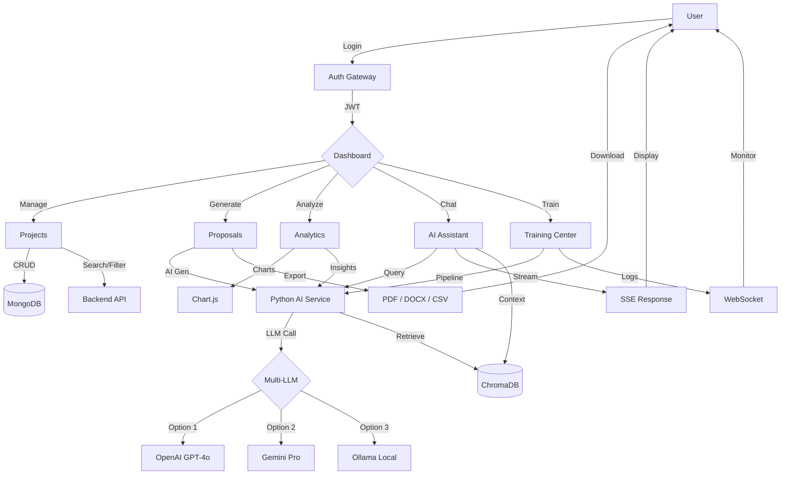

<div align="center">

<!-- ANIMATED HERO TITLE -->
<svg width="100%" height="80" viewBox="0 0 800 80" xmlns="http://www.w3.org/2000/svg">
  <defs>
    <linearGradient id="heroGlow" x1="0%" y1="0%" x2="100%" y2="0%">
      <stop offset="0%" stop-color="#00E5FF">
        <animate attributeName="stop-color" values="#00E5FF;#7C3AED;#00E5FF" dur="4s" repeatCount="indefinite"/>
      </stop>
      <stop offset="50%" stop-color="#7C3AED">
        <animate attributeName="stop-color" values="#7C3AED;#00E5FF;#7C3AED" dur="4s" repeatCount="indefinite"/>
      </stop>
      <stop offset="100%" stop-color="#00E5FF">
        <animate attributeName="stop-color" values="#00E5FF;#7C3AED;#00E5FF" dur="4s" repeatCount="indefinite"/>
      </stop>
    </linearGradient>
    <filter id="glow" x="-20%" y="-20%" width="140%" height="140%">
      <feGaussianBlur stdDeviation="3" result="blur">
        <animate attributeName="stdDeviation" values="3;6;3" dur="2s" repeatCount="indefinite"/>
      </feGaussianBlur>
      <feMerge>
        <feMergeNode in="blur"/>
        <feMergeNode in="SourceGraphic"/>
      </feMerge>
    </filter>
  </defs>
  <text x="400" y="50" text-anchor="middle" font-size="42" font-weight="800" font-family="system-ui, sans-serif" fill="url(#heroGlow)" filter="url(#glow)">⚡ ProposalForge AI v2.0</text>
  <text x="400" y="72" text-anchor="middle" font-size="14" fill="#888888" font-family="system-ui, sans-serif">MERN + Python AI Microservice Platform</text>
</svg>

> **Intelligent Proposal Generation & Project Management Powered by Multi-LLM Architecture**

<br>

<!-- ANIMATED BADGES ROW -->
<svg width="100%" height="36" viewBox="0 0 840 36" xmlns="http://www.w3.org/2000/svg">
  <rect x="0" y="8" rx="4" ry="4" width="140" height="22" fill="#222222" opacity="0.8"/>
  <text x="6" y="23" font-size="11" fill="#888" font-family="monospace">★</text>
  <text x="20" y="23" font-size="11" fill="#eee" font-family="monospace" font-weight="bold">Stars</text>
  <text x="100" y="23" font-size="11" fill="#FFD700" font-family="monospace">—</text>

  <rect x="152" y="8" rx="4" ry="4" width="140" height="22" fill="#222222" opacity="0.8"/>
  <text x="158" y="23" font-size="11" fill="#888" font-family="monospace">⑂</text>
  <text x="172" y="23" font-size="11" fill="#eee" font-family="monospace" font-weight="bold">Forks</text>
  <text x="252" y="23" font-size="11" fill="#58A6FF" font-family="monospace">—</text>

  <rect x="304" y="8" rx="4" ry="4" width="160" height="22" fill="#222222" opacity="0.8"/>
  <text x="310" y="23" font-size="11" fill="#888" font-family="monospace">⬢</text>
  <text x="324" y="23" font-size="11" fill="#eee" font-family="monospace" font-weight="bold">License</text>
  <text x="420" y="23" font-size="11" fill="#3FB950" font-family="monospace">MIT</text>

  <rect x="476" y="8" rx="4" ry="4" width="150" height="22" fill="#222222" opacity="0.8"/>
  <!-- Live pulse dot -->
  <circle cx="486" cy="19" r="4" fill="#00E5FF">
    <animate attributeName="opacity" values="1;0.2;1" dur="1.5s" repeatCount="indefinite"/>
    <animate attributeName="r" values="4;5;4" dur="1.5s" repeatCount="indefinite"/>
  </circle>
  <text x="496" y="23" font-size="11" fill="#eee" font-family="monospace" font-weight="bold">Visitors</text>
  <text x="590" y="23" font-size="11" fill="#BC8CFF" font-family="monospace">—</text>

  <rect x="638" y="8" rx="4" ry="4" width="100" height="22" fill="#222222" opacity="0.8"/>
  <text x="650" y="23" font-size="11" fill="#3FB950" font-family="monospace" font-weight="bold">● Active</text>
  <circle cx="725" cy="19" r="3" fill="#3FB950">
    <animate attributeName="opacity" values="1;0.3;1" dur="1s" repeatCount="indefinite"/>
  </circle>

  <rect x="750" y="8" rx="4" ry="4" width="80" height="22" fill="#222222" opacity="0.8"/>
  <text x="756" y="23" font-size="11" fill="#C97586" font-family="monospace" font-weight="bold">PRs ✓</text>
</svg>

<br>

<p>
  <a href="#-features">Features</a> •
  <a href="#-system-architecture">Architecture</a> •
  <a href="#-installation">Installation</a> •
  <a href="#-api-documentation">API Docs</a> •
  <a href="#-deployment">Deployment</a> •
  <a href="#-contributing">Contributing</a>
</p>

<br>


<br><br>

<!-- TYPING + CONTINUOUS ANIMATION -->
<p>
  
</p>

<br>

<!-- CONTINUOUS ANIMATED PROGRESS BAR - SYSTEM STATUS -->
<svg width="600" height="40" viewBox="0 0 600 40" xmlns="http://www.w3.org/2000/svg">
  <rect x="0" y="12" width="600" height="16" rx="8" fill="#1a1a2e"/>
  <rect x="0" y="12" width="600" height="16" rx="8" fill="url(#barGrad)" opacity="0.3"/>
  <defs>
    <linearGradient id="barGrad" x1="0" y1="0" x2="1" y2="0">
      <stop offset="0%" stop-color="#00E5FF"/>
      <stop offset="50%" stop-color="#7C3AED"/>
      <stop offset="100%" stop-color="#00E5FF"/>
    </linearGradient>
    <clipPath id="barClip">
      <rect x="0" y="12" width="600" height="16" rx="8"/>
    </clipPath>
  </defs>
  <rect clip-path="url(#barClip)" x="-600" y="12" width="600" height="16" fill="url(#barGrad)" opacity="0.8">
    <animate attributeName="x" from="-600" to="600" dur="3s" repeatCount="indefinite"/>
  </rect>
  <text x="300" y="24" text-anchor="middle" font-size="10" fill="#fff" font-family="monospace" font-weight="bold">● SYSTEM ONLINE — ALL SERVICES OPERATIONAL</text>
</svg>

</div>

---

## 📑 Table of Contents

- [Overview](#-overview)
- [Features](#-features)
- [Screenshots](#-screenshots)
- [System Architecture](#-system-architecture)
- [Folder Structure](#-folder-structure)
- [Installation](#-installation)
- [Environment Variables](#-environment-variables)
- [Running the Project](#-running-the-project)
- [API Documentation](#-api-documentation)
- [Workflow Diagram](#-workflow-diagram)
- [Deployment](#-deployment)
- [Future Improvements](#-future-improvements)
- [Contributing](#-contributing)
- [Author](#-author)
- [License](#-license)

---

## 📖 Overview

**ProposalForge AI v2.0** is an enterprise-grade, full-stack application that combines the power of the **MERN stack** with a **Python AI microservice** to deliver intelligent proposal generation, project management, analytics, and knowledge-driven workflow automation.

The platform supports **multiple LLM providers** — OpenAI, Gemini, and Ollama — and leverages **ChromaDB** for vector-based semantic search, enabling context-aware AI responses. From dynamic scope selection to real-time proposal previews and bulk exports, ProposalForge AI streamlines the entire project lifecycle.

<br>

<p align="center">
  
  <br>
  <em>Analytics Dashboard — Interactive Charts & Real-Time Insights</em>
</p>

---

<!-- ANIMATED SECTION DIVIDER -->
<svg width="100%" height="24" viewBox="0 0 800 24" xmlns="http://www.w3.org/2000/svg">
  <line x1="0" y1="12" x2="800" y2="12" stroke="#333" stroke-width="1" opacity="0.5"/>
  <circle cx="400" cy="12" r="6" fill="#00E5FF">
    <animate attributeName="r" values="6;8;6" dur="2s" repeatCount="indefinite"/>
    <animate attributeName="opacity" values="1;0.4;1" dur="2s" repeatCount="indefinite"/>
  </circle>
  <circle cx="400" cy="12" r="12" fill="none" stroke="#00E5FF" stroke-width="0.5" opacity="0.3">
    <animate attributeName="r" values="12;20;12" dur="2s" repeatCount="indefinite"/>
    <animate attributeName="opacity" values="0.3;0;0.3" dur="2s" repeatCount="indefinite"/>
  </circle>
</svg>

## 🚀 Features

<details open>
<summary><strong>📋 Project Management</strong></summary>
<br>

| Feature | Description |
|---------|-------------|
| **Create Project** | Build new projects with rich metadata and scope assignment |
| **Edit Project** | Modify project details, scope, and technology mappings |
| **Delete Project** | Remove projects with cascade cleanup |
| **Search Projects** | Full-text search across project titles, descriptions, and tags |
| **Filter Projects** | Filter by status, category, technology, and date range |
| **Pagination** | Server-side paginated responses for large datasets |
| **Project Details** | Comprehensive project view with all associated data |

</details>

<details>
<summary><strong>🎯 Scope & Category System</strong></summary>
<br>

- **Dynamic Scope Selection** — Hierarchical scope trees with real-time updates
- **Category Management** — Create, edit, delete categories with validation
- **Multi-Select Support** — Assign multiple scopes/categories per project
- **Technology Mapping** — Map technologies to scopes for intelligent proposal generation

</details>

<details>
<summary><strong>📄 Proposal System</strong></summary>
<br>

- **AI Proposal Generation** — Generate professional proposals using multi-LLM AI engine
- **Dynamic Proposal Templates** — Customizable templates with variable injection
- **Real-Time Preview** — Live Markdown-to-HTML rendering as you edit
- **PDF Generation** — Server-side PDF rendering with custom styling
- **DOCX Generation** — Microsoft Word-compatible document export

</details>

<details>
<summary><strong>📊 Analytics Dashboard</strong></summary>
<br>

- **Interactive Charts** — Line, bar, pie, and doughnut charts via Chart.js
- **Revenue Analytics** — Track projected vs. actual revenue with trend lines
- **Trends & Insights** — AI-driven anomaly detection and trend forecasting
- **Gantt Timeline** — Visual project scheduling with drag-and-drop adjustments

</details>

<details>
<summary><strong>📦 Export System</strong></summary>
<br>

| Export Type | Format | Status |
|-------------|--------|--------|
| CSV Export | `.csv` | ✅ Supported |
| Excel Export | `.xlsx` | ✅ Supported |
| PDF Export | `.pdf` | ✅ Supported |
| Bulk Export | Multi-format | ✅ Supported |

</details>

<details>
<summary><strong>🧠 AI Knowledge System</strong></summary>
<br>

- **ChatGPT-Style AI Assistant** — Conversational interface with thread history
- **Multi-Model Support** — Seamlessly switch between OpenAI, Gemini, and Ollama
- **OpenAI Integration** — GPT-4o / GPT-4-turbo with streaming responses
- **Gemini Integration** — Google Gemini Pro with function calling
- **Ollama Integration** — Local LLM inference (Llama 3, Mistral, etc.)
- **ChromaDB Vector Search** — Persistent vector database for semantic retrieval
- **Knowledge Indexing** — Automated document chunking and embedding pipeline
- **Semantic Search** — Cosine similarity search over indexed knowledge base
- **Context-Based Responses** — Retrieval-Augmented Generation (RAG) pipeline

</details>

<details>
<summary><strong>🎓 Training Center</strong></summary>
<br>

| Feature | Description |
|---------|-------------|
| **Training Progress** | Real-time epoch/batch progress bars |
| **Real-Time Logs** | WebSocket-streamed training logs |
| **Training History** | Historical runs with metrics comparison |
| **Incremental Training** | Fine-tune existing models without full retrain |
| **Stop Training** | Graceful training interruption with checkpoint save |
| **Live Status Tracking** | Model status, GPU utilization, memory usage |

</details>

---

<!-- ANIMATED SECTION DIVIDER -->
<svg width="100%" height="24" viewBox="0 0 800 24" xmlns="http://www.w3.org/2000/svg">
  <line x1="0" y1="12" x2="800" y2="12" stroke="#333" stroke-width="1" opacity="0.5"/>
  <circle cx="400" cy="12" r="6" fill="#7C3AED">
    <animate attributeName="r" values="6;8;6" dur="2s" repeatCount="indefinite"/>
    <animate attributeName="opacity" values="1;0.4;1" dur="2s" repeatCount="indefinite"/>
  </circle>
  <circle cx="400" cy="12" r="12" fill="none" stroke="#7C3AED" stroke-width="0.5" opacity="0.3">
    <animate attributeName="r" values="12;20;12" dur="2s" repeatCount="indefinite"/>
    <animate attributeName="opacity" values="0.3;0;0.3" dur="2s" repeatCount="indefinite"/>
  </circle>
</svg>

## 📸 Screenshots

<div align="center">

| | |
|:---:|:---:|
|  **Landing Page** |  **Authentication** |
|  **Project Management** |  **Proposal Engine** |
|  **Analytics Dashboard** |  **AI Knowledge Assistant** |
|  **Training Center** |  **Export System** |
|  **Settings & Configuration** | |

</div>

---

<!-- ANIMATED SECTION DIVIDER -->
<svg width="100%" height="24" viewBox="0 0 800 24" xmlns="http://www.w3.org/2000/svg">
  <line x1="0" y1="12" x2="800" y2="12" stroke="#333" stroke-width="1" opacity="0.5"/>
  <circle cx="400" cy="12" r="6" fill="#00E5FF">
    <animate attributeName="r" values="6;8;6" dur="2s" repeatCount="indefinite"/>
    <animate attributeName="opacity" values="1;0.4;1" dur="2s" repeatCount="indefinite"/>
  </circle>
  <circle cx="400" cy="12" r="12" fill="none" stroke="#00E5FF" stroke-width="0.5" opacity="0.3">
    <animate attributeName="r" values="12;20;12" dur="2s" repeatCount="indefinite"/>
    <animate attributeName="opacity" values="0.3;0;0.3" dur="2s" repeatCount="indefinite"/>
  </circle>
</svg>

## 🏗️ System Architecture

```
┌─────────────────────────────────────────────────────────────────────┐
│                        CLIENT LAYER (React 18)                      │
│  ┌──────────┐  ┌──────────┐  ┌──────────┐  ┌────────────────────┐  │
│  │  Auth UI  │  │  Proj.   │  │Proposal  │  │  AI Chat Assistant │  │
│  │          │  │  Mgmt    │  │ Engine   │  │  (Streaming)       │  │
│  └──────────┘  └──────────┘  └──────────┘  └────────────────────┘  │
│                        ▲              ▲                             │
│                        │  REST/SSE    │  WebSocket                  │
└────────────────────────┼──────────────┼─────────────────────────────┘
                         │              │
┌────────────────────────┼──────────────┼─────────────────────────────┐
│              API GATEWAY (Express.js) │                             │
│  ┌─────────────────────┴──────┬───────┴─────────────────────────┐   │
│  │        REST API           │       WebSocket Server          │   │
│  │  /api/auth  /api/projects │  /ws/training  /ws/chat         │   │
│  │  /api/proposals /api/ai   │  /ws/notifications              │   │
│  └───────────────────────────┴─────────────────────────────────┘   │
│                        │              │                             │
│  ┌─────────────────────┴──────────────┴─────────────────────────┐  │
│  │                    SERVICES LAYER                             │  │
│  │  ┌────────┐ ┌──────────┐ ┌──────────┐ ┌───────────────────┐  │  │
│  │  │Auth    │ │Project   │ │Proposal  │ │ Export Service    │  │  │
│  │  │Service │ │Service   │ │Service   │ │ (CSV/XLSX/PDF)    │  │  │
│  │  └────────┘ └──────────┘ └──────────┘ └───────────────────┘  │  │
│  └─────────────────────┬─────────────────────────────────────────┘  │
│                        │                                            │
│  ┌─────────────────────┴─────────────────────────────────────────┐  │
│  │              DATA LAYER (MongoDB + Redis)                      │  │
│  │  ┌──────────┐ ┌──────────┐ ┌──────────┐ ┌────────────────┐   │  │
│  │  │ Users    │ │ Projects │ │Proposals │ │  Sessions      │   │  │
│  │  │          │ │          │ │          │ │  (Redis)       │   │  │
│  │  └──────────┘ └──────────┘ └──────────┘ └────────────────┘   │  │
│  └───────────────────────────────────────────────────────────────┘  │
└─────────────────────────────────────────────────────────────────────┘
                                    │
┌───────────────────────────────────┴──────────────────────────────────┐
│                   PYTHON AI MICROSERVICE (FastAPI)                    │
│  ┌──────────────┐  ┌──────────────┐  ┌───────────────────────────┐  │
│  │   LLM Orc.   │  │   Embedding  │  │   RAG Pipeline            │  │
│  │  ┌────────┐  │  │   Service    │  │  ┌─────────────────────┐  │  │
│  │  │OpenAI  │  │  │  (sentence-  │  │  │ Query → Retrieve →  │  │  │
│  │  │Gemini  │  │  │   trans.)    │  │  │ Augment → Generate  │  │  │
│  │  │Ollama  │  │  │              │  │  └─────────────────────┘  │  │
│  │  └────────┘  │  └──────────────┘  │                           │  │
│  └──────────────┘  ┌──────────────┐  └───────────────────────────┘  │
│                    │  ChromaDB    │                                   │
│                    │  Vector DB   │                                   │
│                    │  (Persistent)│                                   │
│                    └──────────────┘                                   │
└──────────────────────────────────────────────────────────────────────┘
```

---

<!-- ANIMATED SECTION DIVIDER -->
<svg width="100%" height="24" viewBox="0 0 800 24" xmlns="http://www.w3.org/2000/svg">
  <line x1="0" y1="12" x2="800" y2="12" stroke="#333" stroke-width="1" opacity="0.5"/>
  <circle cx="400" cy="12" r="6" fill="#7C3AED">
    <animate attributeName="r" values="6;8;6" dur="2s" repeatCount="indefinite"/>
    <animate attributeName="opacity" values="1;0.4;1" dur="2s" repeatCount="indefinite"/>
  </circle>
  <circle cx="400" cy="12" r="12" fill="none" stroke="#7C3AED" stroke-width="0.5" opacity="0.3">
    <animate attributeName="r" values="12;20;12" dur="2s" repeatCount="indefinite"/>
    <animate attributeName="opacity" values="0.3;0;0.3" dur="2s" repeatCount="indefinite"/>
  </circle>
</svg>

## 📁 Folder Structure

```
ProposalForge-AI/
├── frontend/                          # React 18 + Tailwind CSS
│   ├── public/
│   ├── src/
│   │   ├── components/                # Reusable UI components
│   │   │   ├── common/                # Button, Input, Modal, Table
│   │   │   ├── layout/                # Navbar, Sidebar, Footer
│   │   │   ├── projects/              # Project CRUD components
│   │   │   ├── proposals/             # Proposal generation UI
│   │   │   ├── analytics/             # Charts & dashboard widgets
│   │   │   ├── ai/                    # AI chat interface
│   │   │   └── training/              # Training center UI
│   │   ├── pages/                     # Route pages
│   │   ├── hooks/                     # Custom React hooks
│   │   ├── services/                  # API client & WebSocket
│   │   ├── store/                     # Redux/Zustand state
│   │   ├── utils/                     # Helpers & constants
│   │   └── App.jsx
│   ├── package.json
│   └── tailwind.config.js
│
├── backend/                           # Node.js + Express + MongoDB
│   ├── src/
│   │   ├── config/                    # DB, env, cors config
│   │   ├── controllers/               # Route handlers
│   │   ├── middleware/                 # Auth, validation, error handler
│   │   ├── models/                    # Mongoose schemas
│   │   ├── routes/                    # Express routers
│   │   ├── services/                  # Business logic
│   │   ├── utils/                     # JWT, helpers, constants
│   │   ├── websocket/                 # Socket.io events
│   │   └── server.js
│   ├── package.json
│   └── .env.example
│
├── python-ai/                         # FastAPI AI microservice
│   ├── app/
│   │   ├── api/                       # Route endpoints
│   │   ├── core/                      # Config, security
│   │   ├── models/                    # Pydantic schemas
│   │   ├── services/
│   │   │   ├── llm/                   # OpenAI, Gemini, Ollama clients
│   │   │   ├── rag/                   # Retrieval-Augmented Generation
│   │   │   └── training/             # Model training pipeline
│   │   ├── vectordb/                  # ChromaDB interface
│   │   └── main.py
│   ├── requirements.txt
│   └── Dockerfile
│
├── docs/                              # API docs, architecture docs
├── templates/                         # Proposal DOCX/PDF templates
├── assets/                            # Screenshots and media
└── README.md                          # You are here
```

---

<!-- ANIMATED SECTION DIVIDER -->
<svg width="100%" height="24" viewBox="0 0 800 24" xmlns="http://www.w3.org/2000/svg">
  <line x1="0" y1="12" x2="800" y2="12" stroke="#333" stroke-width="1" opacity="0.5"/>
  <circle cx="400" cy="12" r="6" fill="#00E5FF">
    <animate attributeName="r" values="6;8;6" dur="2s" repeatCount="indefinite"/>
    <animate attributeName="opacity" values="1;0.4;1" dur="2s" repeatCount="indefinite"/>
  </circle>
  <circle cx="400" cy="12" r="12" fill="none" stroke="#00E5FF" stroke-width="0.5" opacity="0.3">
    <animate attributeName="r" values="12;20;12" dur="2s" repeatCount="indefinite"/>
    <animate attributeName="opacity" values="0.3;0;0.3" dur="2s" repeatCount="indefinite"/>
  </circle>
</svg>

## 🔧 Installation

### Prerequisites

- **Node.js** ≥ 18.x
- **Python** ≥ 3.10
- **MongoDB** ≥ 6.x (local or Atlas)
- **Redis** (optional, for session caching)

### Clone the Repository

```bash
git clone https://github.com/riteshpatil12/ProposalForge-AI.git
cd ProposalForge-AI
```

### 1️⃣ Backend Setup

```bash
cd backend
npm install
```

### 2️⃣ Frontend Setup

```bash
cd frontend
npm install
```

### 3️⃣ Python AI Microservice Setup

```bash
cd python-ai
python -m venv venv
source venv/bin/activate   # On Windows: venv\Scripts\activate
pip install -r requirements.txt
```

---

<!-- ANIMATED SECTION DIVIDER -->
<svg width="100%" height="24" viewBox="0 0 800 24" xmlns="http://www.w3.org/2000/svg">
  <line x1="0" y1="12" x2="800" y2="12" stroke="#333" stroke-width="1" opacity="0.5"/>
  <circle cx="400" cy="12" r="6" fill="#7C3AED">
    <animate attributeName="r" values="6;8;6" dur="2s" repeatCount="indefinite"/>
    <animate attributeName="opacity" values="1;0.4;1" dur="2s" repeatCount="indefinite"/>
  </circle>
  <circle cx="400" cy="12" r="12" fill="none" stroke="#7C3AED" stroke-width="0.5" opacity="0.3">
    <animate attributeName="r" values="12;20;12" dur="2s" repeatCount="indefinite"/>
    <animate attributeName="opacity" values="0.3;0;0.3" dur="2s" repeatCount="indefinite"/>
  </circle>
</svg>

## 🌍 Environment Variables

Create a `.env` file in each service directory.

### Backend (`backend/.env`)

```env
# Server
PORT=5000
NODE_ENV=development

# MongoDB
MONGODB_URI=mongodb://localhost:27017/proposalforge

# JWT
JWT_SECRET=your_jwt_secret_here
JWT_EXPIRES_IN=7d

# Redis (optional)
REDIS_URL=redis://localhost:6379

# CORS
CORS_ORIGIN=http://localhost:3000

# Python AI Microservice URL
AI_SERVICE_URL=http://localhost:8000
```

### Frontend (`frontend/.env`)

```env
VITE_API_URL=http://localhost:5000/api
VITE_AI_SERVICE_URL=http://localhost:8000
VITE_WS_URL=ws://localhost:5000
```

### Python AI (`python-ai/.env`)

```env
# FastAPI
PORT=8000
ENV=development

# OpenAI
OPENAI_API_KEY=sk-your-openai-key
OPENAI_MODEL=gpt-4o

# Gemini
GEMINI_API_KEY=your-gemini-key
GEMINI_MODEL=gemini-1.5-pro

# Ollama
OLLAMA_BASE_URL=http://localhost:11434
OLLAMA_MODEL=llama3

# ChromaDB
CHROMA_PERSIST_DIR=./chroma_db

# MongoDB (for training metadata)
MONGODB_URI=mongodb://localhost:27017/proposalforge_ai

# Embedding Model
EMBEDDING_MODEL=sentence-transformers/all-MiniLM-L6-v2
```

---

<!-- ANIMATED SECTION DIVIDER -->
<svg width="100%" height="24" viewBox="0 0 800 24" xmlns="http://www.w3.org/2000/svg">
  <line x1="0" y1="12" x2="800" y2="12" stroke="#333" stroke-width="1" opacity="0.5"/>
  <circle cx="400" cy="12" r="6" fill="#00E5FF">
    <animate attributeName="r" values="6;8;6" dur="2s" repeatCount="indefinite"/>
    <animate attributeName="opacity" values="1;0.4;1" dur="2s" repeatCount="indefinite"/>
  </circle>
  <circle cx="400" cy="12" r="12" fill="none" stroke="#00E5FF" stroke-width="0.5" opacity="0.3">
    <animate attributeName="r" values="12;20;12" dur="2s" repeatCount="indefinite"/>
    <animate attributeName="opacity" values="0.3;0;0.3" dur="2s" repeatCount="indefinite"/>
  </circle>
</svg>

## ▶️ Running the Project

### Start Backend

```bash
cd backend
npm run dev          # Development with nodemon
# or
npm start            # Production
```

### Start Frontend

```bash
cd frontend
npm run dev          # Vite dev server → http://localhost:3000
# or
npm run build        # Production build
npm run preview      # Preview production build
```

### Start Python AI Microservice

```bash
cd python-ai
source venv/bin/activate
uvicorn app.main:app --reload --host 0.0.0.0 --port 8000
```

### Verify Services

| Service | URL | Status |
|---------|-----|--------|
| Frontend | `http://localhost:3000` | ✅ |
| Backend API | `http://localhost:5000/api` | ✅ |
| AI Microservice | `http://localhost:8000/docs` | ✅ Swagger UI |
| WebSocket | `ws://localhost:5000` | ✅ |

---

<!-- ANIMATED SECTION DIVIDER -->
<svg width="100%" height="24" viewBox="0 0 800 24" xmlns="http://www.w3.org/2000/svg">
  <line x1="0" y1="12" x2="800" y2="12" stroke="#333" stroke-width="1" opacity="0.5"/>
  <circle cx="400" cy="12" r="6" fill="#7C3AED">
    <animate attributeName="r" values="6;8;6" dur="2s" repeatCount="indefinite"/>
    <animate attributeName="opacity" values="1;0.4;1" dur="2s" repeatCount="indefinite"/>
  </circle>
  <circle cx="400" cy="12" r="12" fill="none" stroke="#7C3AED" stroke-width="0.5" opacity="0.3">
    <animate attributeName="r" values="12;20;12" dur="2s" repeatCount="indefinite"/>
    <animate attributeName="opacity" values="0.3;0;0.3" dur="2s" repeatCount="indefinite"/>
  </circle>
</svg>

## 📡 API Documentation

### Authentication

| Method | Endpoint | Description |
|--------|----------|-------------|
| `POST` | `/api/auth/register` | Register new user |
| `POST` | `/api/auth/login` | Login & receive JWT |
| `POST` | `/api/auth/logout` | Invalidate session |
| `GET` | `/api/auth/me` | Get current user profile |
| `PUT` | `/api/auth/me` | Update profile |

### Projects

| Method | Endpoint | Description |
|--------|----------|-------------|
| `GET` | `/api/projects` | List projects (paginated, filterable) |
| `POST` | `/api/projects` | Create project |
| `GET` | `/api/projects/:id` | Get project details |
| `PUT` | `/api/projects/:id` | Update project |
| `DELETE` | `/api/projects/:id` | Delete project |
| `GET` | `/api/projects/search` | Full-text search projects |

### Proposals

| Method | Endpoint | Description |
|--------|----------|-------------|
| `GET` | `/api/proposals` | List proposals |
| `POST` | `/api/proposals` | Generate AI proposal |
| `GET` | `/api/proposals/:id` | Get proposal detail |
| `PUT` | `/api/proposals/:id` | Update proposal |
| `DELETE` | `/api/proposals/:id` | Delete proposal |
| `POST` | `/api/proposals/:id/export/pdf` | Export as PDF |
| `POST` | `/api/proposals/:id/export/docx` | Export as DOCX |

### Analytics

| Method | Endpoint | Description |
|--------|----------|-------------|
| `GET` | `/api/analytics/revenue` | Revenue analytics data |
| `GET` | `/api/analytics/trends` | Trend analysis |
| `GET` | `/api/analytics/insights` | AI-powered insights |
| `GET` | `/api/analytics/gantt` | Gantt timeline data |

### AI Knowledge System

| Method | Endpoint | Description |
|--------|----------|-------------|
| `POST` | `/api/ai/chat` | Send message to AI assistant |
| `GET` | `/api/ai/chat/history` | Get chat history |
| `POST` | `/api/ai/knowledge/index` | Index document in ChromaDB |
| `DELETE` | `/api/ai/knowledge/:id` | Remove indexed document |
| `POST` | `/api/ai/knowledge/search` | Semantic search over knowledge base |
| `GET` | `/api/ai/models` | List available LLM models |
| `PUT` | `/api/ai/models/active` | Switch active model |

### Training

| Method | Endpoint | Description |
|--------|----------|-------------|
| `POST` | `/api/ai/training/start` | Start training job |
| `POST` | `/api/ai/training/stop` | Stop running training |
| `GET` | `/api/ai/training/status` | Get training status |
| `GET` | `/api/ai/training/history` | Training run history |
| `GET` | `/api/ai/training/logs` | Real-time training logs |

### Export

| Method | Endpoint | Description |
|--------|----------|-------------|
| `POST` | `/api/export/csv` | Export data as CSV |
| `POST` | `/api/export/xlsx` | Export data as Excel |
| `POST` | `/api/export/pdf` | Export data as PDF |
| `POST` | `/api/export/bulk` | Bulk export multi-format |

---

<!-- ANIMATED SECTION DIVIDER -->
<svg width="100%" height="24" viewBox="0 0 800 24" xmlns="http://www.w3.org/2000/svg">
  <line x1="0" y1="12" x2="800" y2="12" stroke="#333" stroke-width="1" opacity="0.5"/>
  <circle cx="400" cy="12" r="6" fill="#00E5FF">
    <animate attributeName="r" values="6;8;6" dur="2s" repeatCount="indefinite"/>
    <animate attributeName="opacity" values="1;0.4;1" dur="2s" repeatCount="indefinite"/>
  </circle>
  <circle cx="400" cy="12" r="12" fill="none" stroke="#00E5FF" stroke-width="0.5" opacity="0.3">
    <animate attributeName="r" values="12;20;12" dur="2s" repeatCount="indefinite"/>
    <animate attributeName="opacity" values="0.3;0;0.3" dur="2s" repeatCount="indefinite"/>
  </circle>
</svg>

## 🔄 Workflow Diagram



---

<!-- ANIMATED SECTION DIVIDER -->
<svg width="100%" height="24" viewBox="0 0 800 24" xmlns="http://www.w3.org/2000/svg">
  <line x1="0" y1="12" x2="800" y2="12" stroke="#333" stroke-width="1" opacity="0.5"/>
  <circle cx="400" cy="12" r="6" fill="#7C3AED">
    <animate attributeName="r" values="6;8;6" dur="2s" repeatCount="indefinite"/>
    <animate attributeName="opacity" values="1;0.4;1" dur="2s" repeatCount="indefinite"/>
  </circle>
  <circle cx="400" cy="12" r="12" fill="none" stroke="#7C3AED" stroke-width="0.5" opacity="0.3">
    <animate attributeName="r" values="12;20;12" dur="2s" repeatCount="indefinite"/>
    <animate attributeName="opacity" values="0.3;0;0.3" dur="2s" repeatCount="indefinite"/>
  </circle>
</svg>

## 🚢 Deployment

### Docker (Recommended)

```bash
# Build all services
docker-compose build

# Run full stack
docker-compose up -d

# View logs
docker-compose logs -f
```

### Manual Deployment

#### Backend + Frontend (VPS / Cloud)

```bash
# Build frontend
cd frontend && npm run build

# Serve via Nginx or deploy to Vercel/Netlify
# Backend can be deployed on Railway, Render, or AWS EC2
```

#### Python AI Microservice

```bash
# Deploy on Railway / Render / Fly.io / AWS ECS
# Or use a dedicated GPU instance for Ollama

docker build -t proposalforge-ai ./python-ai
docker run -d -p 8000:8000 proposalforge-ai
```

### Environment-Specific Configs

| Platform | Backend | Frontend | AI Service |
|----------|---------|----------|------------|
| **Railway** | ✅ Supported | — | ✅ Supported |
| **Vercel** | — | ✅ Supported | — |
| **Render** | ✅ Supported | ✅ Supported | ✅ Supported |
| **AWS EC2** | ✅ Supported | ✅ Supported | ✅ Supported (GPU) |
| **DigitalOcean** | ✅ Supported | ✅ Supported | ✅ Supported |

---

<!-- ANIMATED SECTION DIVIDER -->
<svg width="100%" height="24" viewBox="0 0 800 24" xmlns="http://www.w3.org/2000/svg">
  <line x1="0" y1="12" x2="800" y2="12" stroke="#333" stroke-width="1" opacity="0.5"/>
  <circle cx="400" cy="12" r="6" fill="#00E5FF">
    <animate attributeName="r" values="6;8;6" dur="2s" repeatCount="indefinite"/>
    <animate attributeName="opacity" values="1;0.4;1" dur="2s" repeatCount="indefinite"/>
  </circle>
  <circle cx="400" cy="12" r="12" fill="none" stroke="#00E5FF" stroke-width="0.5" opacity="0.3">
    <animate attributeName="r" values="12;20;12" dur="2s" repeatCount="indefinite"/>
    <animate attributeName="opacity" values="0.3;0;0.3" dur="2s" repeatCount="indefinite"/>
  </circle>
</svg>

## 🔮 Future Improvements

- [ ] **Multi-Tenant Support** — Organization-level isolation with role-based access
- [ ] **Advanced RBAC** — Fine-grained permissions per project and document
- [ ] **Kanban Board** — Drag-and-drop project task management
- [ ] **Template Marketplace** — Community-driven proposal template sharing
- [ ] **Custom Model Fine-Tuning** — In-platform LoRA/QLoRA fine-tuning UI
- [ ] **Collaborative Editing** — Real-time multi-user proposal editing with CRDT
- [ ] **Slack / Discord Integration** — Notifications and AI commands via webhook
- [ ] **CI/CD Pipeline** — Automated testing and deployment with GitHub Actions
- [ ] **Mobile App** — React Native companion for on-the-go access
- [ ] **Audit Trail** — Complete event logging and compliance reporting

---

<!-- ANIMATED SECTION DIVIDER -->
<svg width="100%" height="24" viewBox="0 0 800 24" xmlns="http://www.w3.org/2000/svg">
  <line x1="0" y1="12" x2="800" y2="12" stroke="#333" stroke-width="1" opacity="0.5"/>
  <circle cx="400" cy="12" r="6" fill="#7C3AED">
    <animate attributeName="r" values="6;8;6" dur="2s" repeatCount="indefinite"/>
    <animate attributeName="opacity" values="1;0.4;1" dur="2s" repeatCount="indefinite"/>
  </circle>
  <circle cx="400" cy="12" r="12" fill="none" stroke="#7C3AED" stroke-width="0.5" opacity="0.3">
    <animate attributeName="r" values="12;20;12" dur="2s" repeatCount="indefinite"/>
    <animate attributeName="opacity" values="0.3;0;0.3" dur="2s" repeatCount="indefinite"/>
  </circle>
</svg>

## 🤝 Contributing

Contributions are what make the open-source community an amazing place to learn, inspire, and create. Any contributions you make are **greatly appreciated**.

1. **Fork** the Project
2. **Create** your Feature Branch (`git checkout -b feature/AmazingFeature`)
3. **Commit** your Changes (`git commit -m 'Add some AmazingFeature'`)
4. **Push** to the Branch (`git push origin feature/AmazingFeature`)
5. **Open** a Pull Request

Please ensure your code follows the existing style conventions and passes all linting checks.

```bash
# Run linting
cd frontend && npm run lint
cd backend && npm run lint
```

---

<!-- ANIMATED SECTION DIVIDER -->
<svg width="100%" height="24" viewBox="0 0 800 24" xmlns="http://www.w3.org/2000/svg">
  <line x1="0" y1="12" x2="800" y2="12" stroke="#333" stroke-width="1" opacity="0.5"/>
  <circle cx="400" cy="12" r="6" fill="#00E5FF">
    <animate attributeName="r" values="6;8;6" dur="2s" repeatCount="indefinite"/>
    <animate attributeName="opacity" values="1;0.4;1" dur="2s" repeatCount="indefinite"/>
  </circle>
  <circle cx="400" cy="12" r="12" fill="none" stroke="#00E5FF" stroke-width="0.5" opacity="0.3">
    <animate attributeName="r" values="12;20;12" dur="2s" repeatCount="indefinite"/>
    <animate attributeName="opacity" values="0.3;0;0.3" dur="2s" repeatCount="indefinite"/>
  </circle>
</svg>

## 👨‍💻 Author

<div align="center">

<table>
  <tr>
    <td align="center">
      <a href="https://github.com/riteshpatil12">
        <br />
        <sub><b>Ritesh Patil</b></sub>
      </a>
      <br />
      <sub>🚀 Full-Stack & AI Developer</sub>
    </td>
  </tr>
</table>

<p>
  <a href="https://github.com/riteshpatil12">
    
  </a>
  <a href="https://www.linkedin.com/in/riteshpatil12/">
    
  </a>
  <a href="mailto:riteshpatil.dev@gmail.com">
    
  </a>
</p>

</div>

---

<!-- ANIMATED SECTION DIVIDER -->
<svg width="100%" height="24" viewBox="0 0 800 24" xmlns="http://www.w3.org/2000/svg">
  <line x1="0" y1="12" x2="800" y2="12" stroke="#333" stroke-width="1" opacity="0.5"/>
  <circle cx="400" cy="12" r="6" fill="#7C3AED">
    <animate attributeName="r" values="6;8;6" dur="2s" repeatCount="indefinite"/>
    <animate attributeName="opacity" values="1;0.4;1" dur="2s" repeatCount="indefinite"/>
  </circle>
  <circle cx="400" cy="12" r="12" fill="none" stroke="#7C3AED" stroke-width="0.5" opacity="0.3">
    <animate attributeName="r" values="12;20;12" dur="2s" repeatCount="indefinite"/>
    <animate attributeName="opacity" values="0.3;0;0.3" dur="2s" repeatCount="indefinite"/>
  </circle>
</svg>

## 📄 License

Distributed under the **MIT License**. See `LICENSE` for more information.

```
MIT License

Copyright (c) 2026 Ritesh Patil

Permission is hereby granted, free of charge, to any person obtaining a copy
of this software and associated documentation files (the "Software"), to deal
in the Software without restriction, including without limitation the rights
to use, copy, modify, merge, publish, distribute, sublicense, and/or sell
copies of the Software, and to permit persons to whom the Software is
furnished to do so, subject to the following conditions:

The above copyright notice and this permission notice shall be included in all
copies or substantial portions of the Software.

THE SOFTWARE IS PROVIDED "AS IS", WITHOUT WARRANTY OF ANY KIND, EXPRESS OR
IMPLIED, INCLUDING BUT NOT LIMITED TO THE WARRANTIES OF MERCHANTABILITY,
FITNESS FOR A PARTICULAR PURPOSE AND NONINFRINGEMENT. IN NO EVENT SHALL THE
AUTHORS OR COPYRIGHT HOLDERS BE LIABLE FOR ANY CLAIM, DAMAGES OR OTHER
LIABILITY, WHETHER IN AN ACTION OF CONTRACT, TORT OR OTHERWISE, ARISING FROM,
OUT OF OR IN CONNECTION WITH THE SOFTWARE OR THE USE OR OTHER DEALINGS IN THE
SOFTWARE.
```

---

<!-- CONTINUOUS ANIMATED FOOTER -->
<div align="center">

<svg width="100%" height="100" viewBox="0 0 800 100" xmlns="http://www.w3.org/2000/svg">
  <defs>
    <linearGradient id="footerGrad" x1="0%" y1="0%" x2="100%" y2="0%">
      <stop offset="0%" stop-color="#00E5FF">
        <animate attributeName="stop-color" values="#00E5FF;#7C3AED;#00E5FF" dur="6s" repeatCount="indefinite"/>
      </stop>
      <stop offset="100%" stop-color="#7C3AED">
        <animate attributeName="stop-color" values="#7C3AED;#00E5FF;#7C3AED" dur="6s" repeatCount="indefinite"/>
      </stop>
    </linearGradient>
  </defs>

  <!-- Star divider line -->
  <line x1="100" y1="20" x2="700" y2="20" stroke="url(#footerGrad)" stroke-width="1" opacity="0.4"/>

  <!-- Animated stars -->
  <text x="400" y="45" text-anchor="middle" font-size="18" fill="#FFD700" font-family="sans-serif">
    <animate attributeName="opacity" values="1;0.4;1" dur="2s" repeatCount="indefinite"/>
    ★ ★ ★
  </text>

  <!-- Footer text -->
  <text x="400" y="68" text-anchor="middle" font-size="13" fill="#888" font-family="system-ui, sans-serif">
    <tspan font-weight="bold" fill="#eee">Star this repository</tspan>
    <tspan fill="#888"> if you find it useful!</tspan>
  </text>

  <text x="400" y="88" text-anchor="middle" font-size="11" fill="#555" font-family="system-ui, sans-serif">
    Built with ❤️ using React · Node.js · MongoDB · Python AI
  </text>
</svg>

<p>
  <sub>© 2026 Ritesh Patil — ProposalForge AI v2.0</sub>
</p>

</div>
